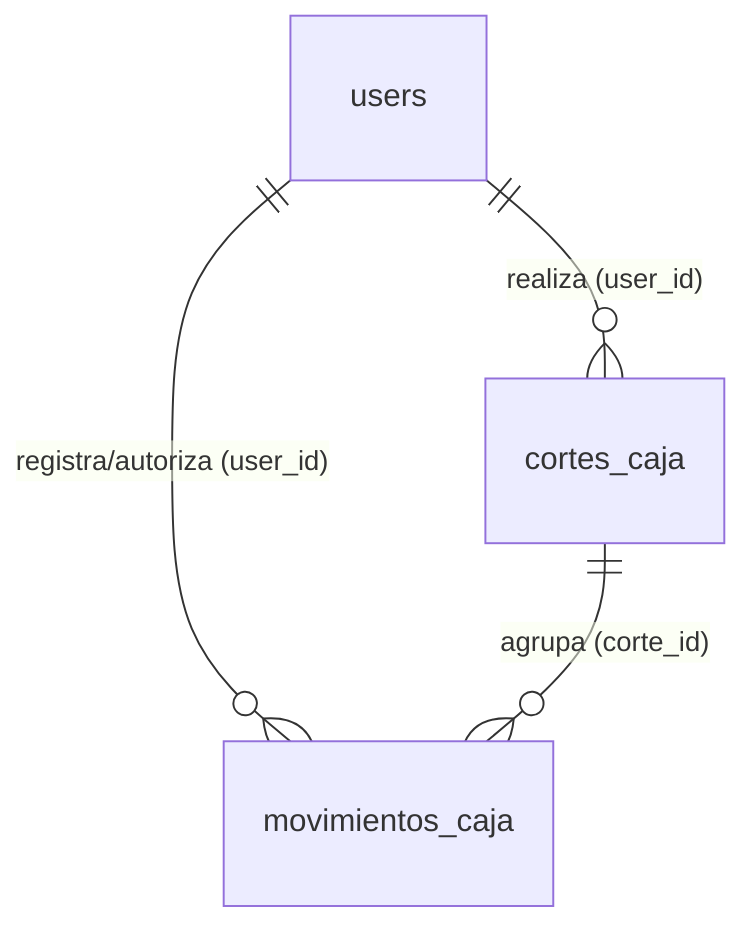

# Módulo 1: Control de Caja y Usuarios

Este módulo es fundamental para la operatividad y seguridad del sistema.
Gestiona el acceso de los empleados (usuarios), la configuración global del
negocio y el flujo estricto del efectivo (cortes y movimientos de caja).

## Diagrama de Relaciones

# Diccionario de Datos

---

## 1. Tabla: `users`

Almacena los empleados e individuos con acceso al sistema. Controla la
autenticación y el nivel de acceso mediante roles.

| Campo                | Tipo de Dato          | Modificadores / Llaves          | Descripción                                                |
| -------------------- | --------------------- | ------------------------------- | ---------------------------------------------------------- |
| `id`                 | `bigint(20) unsigned` | PK, AUTO_INCREMENT              | Identificador único del usuario.                           |
| `name`               | `varchar(255)`        | NOT NULL                        | Nombre completo del empleado/usuario.                      |
| `email`              | `varchar(255)`        | NOT NULL, UNIQUE                | Correo electrónico usado para el inicio de sesión.         |
| `email_verified_at`  | `timestamp`           | NULLABLE                        | Fecha y hora de la verificación del correo.                |
| `password`           | `varchar(255)`        | NOT NULL                        | Contraseña encriptada.                                     |
| `role`               | `varchar(255)`        | NOT NULL, DEFAULT `'Personal'`  | Rol del usuario en el sistema.                             |
| `status`             | `varchar(255)`        | NOT NULL, DEFAULT `'pendiente'` | Estado actual de la cuenta.                                |
| `confirmation_token` | `varchar(255)`        | NULLABLE                        | Token para confirmación de cuenta o reseteo de contraseña. |
| `remember_token`     | `varchar(100)`        | NULLABLE                        | Token de sesión para la función "recordarme".              |
| `created_at`         | `timestamp`           | NULLABLE                        | Fecha de creación del registro.                            |
| `updated_at`         | `timestamp`           | NULLABLE                        | Fecha de última modificación.                              |

---

## 2. Tabla: `configuracion_caja`

Almacena los parámetros generales y estáticos del negocio. Generalmente contiene
un solo registro activo que alimenta los valores por defecto del sistema y
tickets.

| Campo            | Tipo de Dato          | Modificadores / Llaves                     | Descripción                                                |
| ---------------- | --------------------- | ------------------------------------------ | ---------------------------------------------------------- |
| `id`             | `bigint(20) unsigned` | PK, AUTO_INCREMENT                         | Identificador del registro de configuración.               |
| `fondo_inicial`  | `decimal(10,2)`       | NOT NULL, DEFAULT `500.00`                 | Efectivo predeterminado para abrir un nuevo turno de caja. |
| `nombre_negocio` | `varchar(255)`        | NOT NULL, DEFAULT `'Lavandería BunnyKlin'` | Nombre comercial impreso en reportes y tickets.            |
| `direccion`      | `varchar(255)`        | NULLABLE                                   | Calle y número de la sucursal.                             |
| `ciudad`         | `varchar(255)`        | NULLABLE                                   | Ciudad de la sucursal.                                     |
| `telefono`       | `varchar(255)`        | NULLABLE                                   | Teléfono de contacto de la sucursal.                       |
| `codigo_postal`  | `varchar(10)`         | NULLABLE                                   | Código postal de la sucursal.                              |
| `created_at`     | `timestamp`           | NULLABLE                                   | Fecha de creación del registro.                            |
| `updated_at`     | `timestamp`           | NULLABLE                                   | Fecha de última modificación.                              |

---

## 3. Tabla: `cortes_caja`

Registra el ciclo de vida de un turno de trabajo (apertura y cierre). Consolida
los ingresos por ventas y los movimientos manuales para realizar el cuadre
final.

| Campo               | Tipo de Dato          | Modificadores / Llaves                        | Descripción                                                                                    |
| ------------------- | --------------------- | --------------------------------------------- | ---------------------------------------------------------------------------------------------- |
| `id`                | `bigint(20) unsigned` | PK, AUTO_INCREMENT                            | Identificador único del corte.                                                                 |
| `user_id`           | `bigint(20) unsigned` | FK (`users.id`), NULLABLE, ON DELETE SET NULL | Cajero responsable del turno. Si se elimina el usuario, se conserva el corte.                  |
| `folio`             | `varchar(255)`        | NOT NULL, UNIQUE                              | Identificador legible y consecutivo del corte.                                                 |
| `fecha_cierre`      | `datetime`            | NOT NULL                                      | Fecha y hora en la que se finalizó el turno.                                                   |
| `fondo_inicial`     | `decimal(10,2)`       | NOT NULL, DEFAULT `0.00`                      | Dinero físico en caja al momento de abrir el turno.                                            |
| `total_ingresos`    | `decimal(10,2)`       | NOT NULL, DEFAULT `0.00`                      | Sumatoria del efectivo ingresado por ventas durante el turno.                                  |
| `total_gastos`      | `decimal(10,2)`       | NOT NULL, DEFAULT `0.00`                      | Sumatoria de salidas registradas como "gasto".                                                 |
| `total_retiros`     | `decimal(10,2)`       | NOT NULL, DEFAULT `0.00`                      | Sumatoria de salidas registradas como "retiro".                                                |
| `efectivo_esperado` | `decimal(10,2)`       | NOT NULL, DEFAULT `0.00`                      | Efectivo teórico en caja: `(fondo_inicial + total_ingresos) - (total_gastos + total_retiros)`. |
| `efectivo_contado`  | `decimal(10,2)`       | NOT NULL, DEFAULT `0.00`                      | Efectivo real reportado por el cajero al momento del cierre.                                   |
| `diferencia`        | `decimal(10,2)`       | NOT NULL, DEFAULT `0.00`                      | Discrepancia calculada: `efectivo_contado - efectivo_esperado`.                                |
| `facturado`         | `tinyint(1)`          | NOT NULL, DEFAULT `0`                         | Bandera booleana que indica si este corte fue incluido en una factura global.                  |
| `facturapi_id`      | `varchar(255)`        | NULLABLE                                      | ID de la factura generada mediante la integración de Facturapi (si aplica).                    |
| `created_at`        | `timestamp`           | NULLABLE                                      | Fecha y hora en la que se aperturó el turno.                                                   |
| `updated_at`        | `timestamp`           | NULLABLE                                      | Fecha de última modificación.                                                                  |

---

## 4. Tabla: `movimientos_caja`

Registra las entradas y salidas de efectivo que no provienen directamente del
flujo estándar de ventas, sino de acciones manuales operativas.

| Campo                    | Tipo de Dato             | Modificadores / Llaves                              | Descripción                                                                        |
| ------------------------ | ------------------------ | --------------------------------------------------- | ---------------------------------------------------------------------------------- |
| `id`                     | `bigint(20) unsigned`    | PK, AUTO_INCREMENT                                  | Identificador único del movimiento.                                                |
| `user_id`                | `bigint(20) unsigned`    | FK (`users.id`), NULLABLE, ON DELETE SET NULL       | Empleado que registró o autorizó el movimiento.                                    |
| `corte_id`               | `bigint(20) unsigned`    | FK (`cortes_caja.id`), NULLABLE, ON DELETE SET NULL | Turno (corte) activo al cual pertenece el impacto financiero.                      |
| `tipo`                   | `enum('gasto','retiro')` | NOT NULL                                            | Clasificación del egreso de dinero.                                                |
| `monto`                  | `decimal(10,2)`          | NOT NULL                                            | Cantidad monetaria del movimiento.                                                 |
| `concepto_o_responsable` | `varchar(255)`           | NOT NULL                                            | Justificación del egreso (ej. "Compra de bolsas", "Retiro de efectivo por dueño"). |
| `fecha_turno`            | `date`                   | NOT NULL                                            | Fecha operativa o comercial del turno al momento del registro.                     |
| `created_at`             | `timestamp`              | NULLABLE                                            | Fecha de creación del registro.                                                    |
| `updated_at`             | `timestamp`              | NULLABLE                                            | Fecha de última modificación.                                                      |

---

## Lógica de Modelos (Eloquent)

Los modelos correspondientes a este módulo aprovechan las características de
Eloquent (casteo de tipos, scopes y relaciones) para garantizar la integridad de
los datos y encapsular la lógica de negocio.

---

### Modelo `User`

- **Helpers de Autorización:** Define los métodos `isAdmin()` y `isCajero()` que
  verifican el atributo `role`. Esto permite mantener el código de los
  controladores, middleware y vistas Blade mucho más limpio y semántico.
- **Seguridad y Casteo:** Define el casteo de `password` como `hashed`
  (encriptación automática en la asignación) y asegura que los campos sensibles
  (`password`, `remember_token`) se oculten en la propiedad `$hidden` al
  serializar el modelo a arrays o JSON.

---

### Modelo `ConfiguracionCaja`

- **Patrón Singleton (Simulado):** Implementa el método estático `obtener()`.
  Este método utiliza `firstOrCreate()` para asegurar que siempre se devuelva
  una única instancia de configuración global. Si la tabla está vacía,
  inicializa automáticamente la base de datos con los valores predeterminados de
  la sucursal (ej. `'Lavandería BunnyKlin'`, `'76800'`).

---

### Modelo `CorteCaja`

- **Casteo Financiero Riguroso:** Convierte automáticamente 8 campos monetarios
  (como `fondo_inicial`, `total_ingresos`, `diferencia`, etc.) a `decimal:2`
  para evitar errores de coma flotante y asegurar la precisión al momento de
  hacer cálculos en PHP.
- **Relaciones y Filtros:** Define las relaciones núcleo `user()`, `ventas()` y
  `movimientos()`. Además, incorpora métodos helper directos (`gastos()` y
  `retiros()`) que devuelven la relación `movimientos()` ya filtrada por su
  tipo, agilizando el cuadre al cierre de turno.

---

### Modelo `MovimientoCaja`

- **Scopes Operativos (El Turno Activo):**
  - `scopeDelTurno($query)`: Es una pieza clave para la operación diaria. Filtra
    los movimientos que pertenecen al usuario autenticado (`auth()->id()`) y que
    aún no han sido asignados a ningún corte (`whereNull('corte_id')`). Esto
    permite identificar fácilmente el dinero que está flotando en el "turno
    activo" del cajero.
  - `scopeGastos()` y `scopeRetiros()`: Scopes de consulta para segmentar
    fácilmente la sumatoria de egresos.
- **Trazabilidad:** Establece explícitamente a través de `belongsTo` el
  `CorteCaja` al que termina perteneciendo el movimiento y el `User` que fue
  responsable de la acción.
