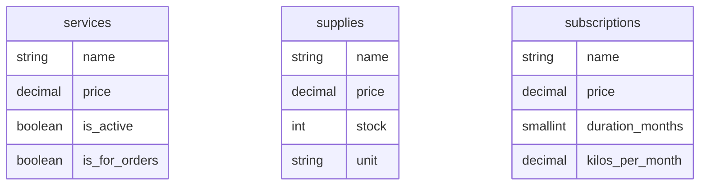

# Módulo 2: Catálogo e Inventario

Este módulo centraliza todos los elementos comercializables de la lavandería. Se
divide en **Servicios** (intangibles o procesos de lavado), **Insumos**
(productos físicos con control de inventario) y **Suscripciones** (paquetes
recurrentes). Todos los elementos están preparados para la facturación
electrónica mediante los catálogos del SAT.

## Diagrama de Entidades



> Nota: Estas entidades son referenciadas de forma polimórfica o dinámica por la
> tabla sale_items al realizar una venta.

# Diccionario de Datos

## 1. Tabla: `services`

Almacena los servicios que ofrece la lavandería. No manejan stock físico, pero
pueden estar configurados para entrega inmediata o para ser procesados como un
pedido a futuro (encargo).

| Campo            | Tipo de Dato          | Modificadores / Llaves | Descripción                                                                                     |
| ---------------- | --------------------- | ---------------------- | ----------------------------------------------------------------------------------------------- |
| `id`             | `bigint(20) unsigned` | PK, AUTO_INCREMENT     | Identificador único del servicio.                                                               |
| `name`           | `varchar(100)`        | NOT NULL               | Nombre descriptivo del servicio (ej. _"Lavado por Encargo"_).                                   |
| `clave_prodserv` | `varchar(8)`          | NULLABLE               | Clave del catálogo de productos y servicios del SAT para facturación CFDI.                      |
| `price`          | `decimal(10,2)`       | NOT NULL               | Precio de venta al público del servicio.                                                        |
| `description`    | `text`                | NULLABLE               | Detalles adicionales o condiciones del servicio.                                                |
| `is_active`      | `tinyint(1)`          | NOT NULL, DEFAULT `1`  | Bandera de borrado lógico (Soft Delete manual). `0` oculta el servicio sin borrar el historial. |
| `is_for_orders`  | `tinyint(1)`          | NOT NULL, DEFAULT `0`  | Define si el servicio genera un ticket de entrega a futuro (Pedido) o es de flujo inmediato.    |
| `created_at`     | `timestamp`           | NULLABLE               | Fecha de registro del servicio.                                                                 |
| `updated_at`     | `timestamp`           | NULLABLE               | Fecha de última modificación de precio o datos.                                                 |

---

## 2. Tabla: `supplies`

Gestiona los productos físicos comercializables (insumos), llevando un control
básico de existencias y sus unidades de medida.

| Campo            | Tipo de Dato          | Modificadores / Llaves | Descripción                                                                          |
| ---------------- | --------------------- | ---------------------- | ------------------------------------------------------------------------------------ |
| `id`             | `bigint(20) unsigned` | PK, AUTO_INCREMENT     | Identificador único del insumo/producto.                                             |
| `name`           | `varchar(100)`        | NOT NULL               | Nombre del producto (ej. _"Detergente Líquido"_, _"Suavizante"_).                    |
| `clave_prodserv` | `varchar(8)`          | NULLABLE               | Clave del catálogo del SAT para facturación CFDI.                                    |
| `price`          | `decimal(10,2)`       | NOT NULL               | Precio unitario de venta al público.                                                 |
| `stock`          | `int(11)`             | NOT NULL, DEFAULT `0`  | Cantidad actual disponible en el inventario físico.                                  |
| `unit`           | `varchar(20)`         | NOT NULL               | Unidad de medida para la venta (ej. _"Pieza"_, _"Litro"_, _"Kg"_).                   |
| `is_active`      | `tinyint(1)`          | NOT NULL, DEFAULT `1`  | Bandera de borrado lógico (Soft Delete manual). `0` desactiva la venta del producto. |
| `created_at`     | `timestamp`           | NULLABLE               | Fecha de registro del insumo.                                                        |
| `updated_at`     | `timestamp`           | NULLABLE               | Fecha de última modificación de precio o stock.                                      |

---

## 3. Tabla: `subscriptions`

Almacena los planes base o membresías que la lavandería ofrece a clientes
frecuentes. Funciona como un catálogo (plantilla) para las suscripciones reales
de los usuarios.

| Campo             | Tipo de Dato          | Modificadores / Llaves   | Descripción                                                                  |
| ----------------- | --------------------- | ------------------------ | ---------------------------------------------------------------------------- |
| `id`              | `bigint(20) unsigned` | PK, AUTO_INCREMENT       | Identificador único de la membresía/plan.                                    |
| `name`            | `varchar(100)`        | NOT NULL                 | Nombre del plan (ej. _"Plan Mensual 20Kg"_).                                 |
| `clave_prodserv`  | `varchar(8)`          | NULLABLE                 | Clave del catálogo del SAT para facturación CFDI.                            |
| `price`           | `decimal(10,2)`       | NOT NULL                 | Costo base del plan a cobrar al cliente.                                     |
| `duration_months` | `smallint(6)`         | NOT NULL                 | Duración en meses del plan antes de requerir renovación.                     |
| `kilos_per_month` | `decimal(8,2)`        | NOT NULL, DEFAULT `0.00` | Cantidad de kilos de ropa a los que el cliente tiene derecho por ciclo/mes.  |
| `description`     | `text`                | NULLABLE                 | Beneficios y términos del paquete.                                           |
| `is_active`       | `tinyint(1)`          | NOT NULL, DEFAULT `1`    | Bandera de borrado lógico. `0` evita que se contrate este plan en el futuro. |
| `created_at`      | `timestamp`           | NULLABLE                 | Fecha de creación del plan.                                                  |
| `updated_at`      | `timestamp`           | NULLABLE                 | Fecha de última modificación del plan.                                       |

---

# Lógica de Modelos (Eloquent)

Los modelos de este módulo están diseñados de manera uniforme y comparten una
decisión arquitectónica fundamental para el Punto de Venta: **el polimorfismo**.

## Características Comunes a Todos los Modelos

### Relación Polimórfica (`salesHistory`)

Los modelos `Service`, `Supply` y `Subscription` implementan el método
`salesHistory()`, que retorna una relación `MorphMany` hacia `SaleItem`.

Esto permite que la tabla de detalle de ventas (`sale_items`) pueda referenciar
dinámicamente a un servicio, un producto físico o una membresía mediante los
campos `item_type` e `item_id`. De esta forma se evita tener múltiples columnas
foráneas nulas o tablas puente redundantes.

### Casteo Estricto

Todos los modelos protegen la integridad de los datos en tiempo de ejecución
mediante el uso de _casts_:

| Atributo    | Cast        | Propósito                                                                    |
| ----------- | ----------- | ---------------------------------------------------------------------------- |
| `price`     | `decimal:2` | Garantiza cálculos financieros precisos en PHP.                              |
| `is_active` | `boolean`   | Facilita el manejo de la disponibilidad del registro como un valor booleano. |

---

## Modelo `Service`

### Lógica de Pedidos

El modelo castea automáticamente el campo `is_for_orders` a `boolean`.

Esto es crucial para el frontend, ya que permite al sistema POS decidir
fácilmente mediante una condición como:

```php
if ($service->is_for_orders) {
    // Crear un pedido con fecha de entrega
} else {
    // Agregar directamente al carrito de venta
}
```

De esta forma el sistema determina si el servicio debe enviarse directamente al
carrito de venta inmediata o si debe desplegar el modal para programar un pedido
a futuro con fecha de entrega.

---

## Modelo `Supply`

### Control Físico

El modelo expone mediante `$fillable` los atributos:

- `stock`
- `unit`

Esto facilita la actualización masiva de inventarios, por ejemplo:

- Recepción de mercancía proveniente de proveedores.
- Descuento automático de existencias después de registrar una venta.

---

## Modelo `Subscription`

### Plantilla de Ciclos

El modelo expone y protege los siguientes campos operativos:

- `duration_months`: vigencia total del plan.
- `kilos_per_month`: límite de consumo mensual.

Este modelo actúa como la **plantilla maestra** de las membresías. Sus datos
serán copiados o utilizados como referencia cuando una suscripción sea asignada
a un cliente específico, permitiendo iniciar la generación de sus ciclos de
consumo.
