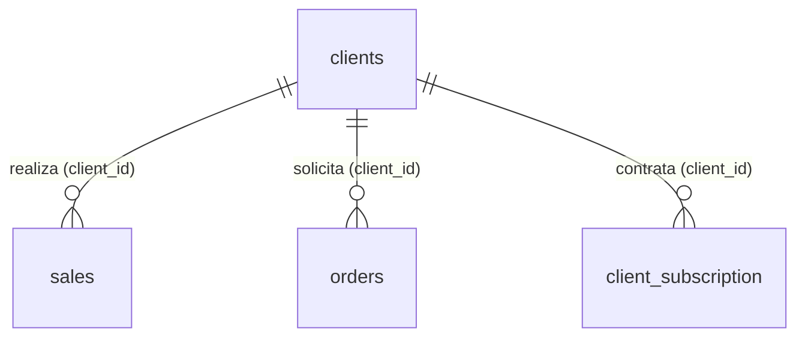

# Módulo 4: Clientes y Facturación

Este módulo funciona como el directorio central de los consumidores de la
lavandería. Su diseño permite manejar de forma independiente la información de
contacto operativo (dirección de recolección/entrega) y la información fiscal
requerida de forma estricta por el SAT (CFDI 4.0) para la emisión de facturas.

## Diagrama de Entidades



## Diccionario de Datos

### 1. Tabla: `clients`

Almacena el perfil completo del cliente. Contiene secciones claramente divididas
para el contacto general, la dirección operativa (para envíos o recolecciones) y
la información de facturación.

| Campo                    | Tipo de Dato          | Modificadores / Llaves      | Descripción                                                                                                     |
| ------------------------ | --------------------- | --------------------------- | --------------------------------------------------------------------------------------------------------------- |
| `id`                     | `bigint(20) unsigned` | **PK**, **AUTO_INCREMENT**  | Identificador único del cliente.                                                                                |
| `name`                   | `varchar(100)`        | **NOT NULL**                | Nombre comercial o público del cliente para trato diario.                                                       |
| `phone`                  | `varchar(20)`         | **NULLABLE**                | Teléfono de contacto.                                                                                           |
| `email`                  | `varchar(255)`        | **NULLABLE**                | Correo electrónico principal (usado para notificaciones o envío de facturas).                                   |
| `codigo_postal`          | `varchar(5)`          | **NULLABLE**                | **(Físico)** Código postal de la ubicación física del cliente.                                                  |
| `calle`                  | `varchar(255)`        | **NULLABLE**                | **(Físico)** Nombre de la calle.                                                                                |
| `numero_exterior`        | `varchar(20)`         | **NULLABLE**                | **(Físico)** Número exterior.                                                                                   |
| `numero_interior`        | `varchar(20)`         | **NULLABLE**                | **(Físico)** Número interior o departamento.                                                                    |
| `colonia`                | `varchar(255)`        | **NULLABLE**                | **(Físico)** Colonia o fraccionamiento.                                                                         |
| `ciudad`                 | `varchar(255)`        | **NULLABLE**                | **(Físico)** Ciudad o municipio.                                                                                |
| `estado`                 | `varchar(255)`        | **NULLABLE**                | **(Físico)** Estado o entidad federativa.                                                                       |
| `rfc`                    | `varchar(14)`         | **NULLABLE**                | **(Fiscal)** Registro Federal de Contribuyentes (requerido para facturar).                                      |
| `razon_social`           | `varchar(255)`        | **NULLABLE**                | **(Fiscal)** Nombre legal exacto asociado al RFC en la Constancia de Situación Fiscal.                          |
| `regimen_fiscal`         | `varchar(10)`         | **NULLABLE**                | **(Fiscal)** Clave del régimen tributario del SAT (ej. `616` para Sin obligaciones, `601` para General de Ley). |
| `same_billing_address`   | `tinyint(1)`          | **NOT NULL**, **DEFAULT 0** | Bandera booleana: `1` indica que la dirección física y la fiscal son exactamente iguales.                       |
| `fiscal_codigo_postal`   | `varchar(5)`          | **NULLABLE**                | **(Fiscal)** Código postal registrado ante el SAT (Dato obligatorio CFDI 4.0).                                  |
| `fiscal_calle`           | `varchar(255)`        | **NULLABLE**                | **(Fiscal)** Calle de facturación.                                                                              |
| `fiscal_numero_exterior` | `varchar(20)`         | **NULLABLE**                | **(Fiscal)** Número exterior de facturación.                                                                    |
| `fiscal_numero_interior` | `varchar(20)`         | **NULLABLE**                | **(Fiscal)** Número interior de facturación.                                                                    |
| `fiscal_colonia`         | `varchar(255)`        | **NULLABLE**                | **(Fiscal)** Colonia de facturación.                                                                            |
| `fiscal_ciudad`          | `varchar(255)`        | **NULLABLE**                | **(Fiscal)** Ciudad de facturación.                                                                             |
| `fiscal_estado`          | `varchar(255)`        | **NULLABLE**                | **(Fiscal)** Estado de facturación.                                                                             |
| `created_at`             | `timestamp`           | **NULLABLE**                | Fecha y hora en la que se registró el cliente en el sistema.                                                    |
| `updated_at`             | `timestamp`           | **NULLABLE**                | Fecha de última modificación de su perfil.                                                                      |

## Lógica de Modelos (Eloquent)

El modelo `Client` es uno de los más ricos en lógica de negocio dentro del
sistema. No solo gestiona sus relaciones tradicionales, sino que inyecta datos
dinámicos (calculados al vuelo) para que la interfaz gráfica (frontend) consuma
la información de las suscripciones sin necesidad de realizar consultas
complejas.

### Modelo `Client`

#### Protección y Casteo

Define de manera estructurada en `$fillable` los datos generales, físicos y
fiscales. Además, asegura que la bandera `same_billing_address` sea tratada
siempre como un valor booleano mediante `$casts`, lo que facilita su
manipulación en checkboxes y validaciones de formularios.

#### Atributos Virtuales (Accessors & Appends)

A través de la propiedad `$appends`, el modelo serializa e inyecta dinámicamente
varios atributos calculados (que no existen como columnas en la tabla) cada vez
que el cliente es devuelto en una respuesta JSON o colección. Esto simplifica
enormemente el trabajo en el frontend (POS).

##### `has_active_subscription`

Retorna un valor booleano verificando si existe un contrato vigente. Es ideal
para habilitar o deshabilitar acciones en la interfaz de usuario.

##### `subscription_name` y `end_subscription`

Utilizan el operador **Nullsafe** (`?->`) y el operador **Null Coalescing**
(`??`) para devolver los datos del plan actual. Si el cliente no cuenta con un
plan vigente, buscan inteligentemente la información del último plan contratado,
facilitando procesos informativos o de recontratación.

##### `remaining_kilos`

Contiene lógica matemática directa. Busca el ciclo de consumo actual
(`currentCycle`) correspondiente al mes en curso y calcula los kilogramos
restantes mediante la operación:

```text
kilos_allowed - kilos_consumed
```

El resultado nunca es negativo, ya que se limita a un mínimo de `0`, incluso
cuando el cliente haya excedido el límite de su plan.

#### Relaciones Inteligentes (Scopes Implícitos)

##### `clientSubscriptions()`

Devuelve el historial completo de todos los contratos que ha tenido el cliente.

##### `currentSubscription()` y `latestSubscription()`

En lugar de procesar los contratos mediante PHP, Eloquent aprovecha SQL
filtrando directamente desde la relación `hasOne`.

- **`currentSubscription()`** únicamente devuelve el contrato cuando:
  - El `status` es `'active'`.
  - La `end_date` es mayor o igual a `today()`.

  Esto garantiza que nunca se apliquen beneficios correspondientes a planes
  vencidos.

- **`latestSubscription()`** devuelve el contrato más reciente del cliente,
  independientemente de si continúa vigente.

#### Ventas y Pedidos

El modelo establece las siguientes relaciones:

- `sales()`: Historial de tickets o ventas pagadas.
- `orders()`: Historial de encargos de ropa.

Estas relaciones permiten mantener un expediente completo (360°) de la actividad
del cliente dentro del sistema.
