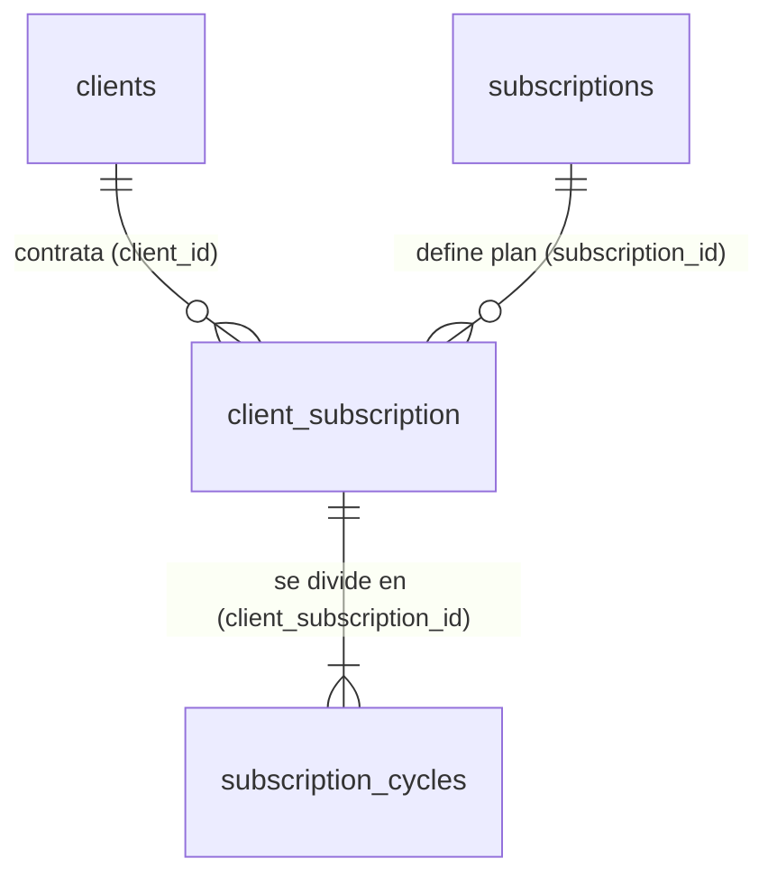

# Módulo 5: Suscripciones

Este módulo gestiona el sistema automatizado de clientes recurrentes de la
lavandería. Su arquitectura está diseñada para soportar planes a largo plazo
divididos en ciclos de consumo (generalmente mensuales), permitiendo un rastreo
auditable de los kilos a los que el cliente tiene derecho frente a los que
realmente ha consumido.

## Diagrama de Entidades



## Diccionario de Datos

### 1. Tabla: `subscriptions`

Actúa como el **Catálogo o Plantilla** de los planes que ofrece la lavandería.
Define las reglas de negocio base (precio, duración y capacidad límite) que se
heredarán a los contratos individuales de los clientes.

| Campo             | Tipo de Dato          | Modificadores / Llaves         | Descripción                                                                                                                                |
| ----------------- | --------------------- | ------------------------------ | ------------------------------------------------------------------------------------------------------------------------------------------ |
| `id`              | `bigint(20) unsigned` | **PK**, **AUTO_INCREMENT**     | Identificador único del plan.                                                                                                              |
| `name`            | `varchar(100)`        | **NOT NULL**                   | Nombre comercial del paquete (ej. _Plan Mensual 20Kg_, _Familiar Semestral_).                                                              |
| `clave_prodserv`  | `varchar(8)`          | **NULLABLE**                   | Clave del catálogo de productos y servicios del SAT para facturación.                                                                      |
| `price`           | `decimal(10,2)`       | **NOT NULL**                   | Costo total o periódico del plan.                                                                                                          |
| `duration_months` | `smallint(6)`         | **NOT NULL**                   | Cantidad de meses que dura el plan antes de su expiración o renovación.                                                                    |
| `kilos_per_month` | `decimal(8,2)`        | **NOT NULL**, **DEFAULT 0.00** | Capacidad o saldo a favor de kilos de ropa que se le otorgarán al cliente cada mes.                                                        |
| `description`     | `text`                | **NULLABLE**                   | Beneficios detallados y condiciones del plan.                                                                                              |
| `is_active`       | `tinyint(1)`          | **NOT NULL**, **DEFAULT 1**    | Borrado lógico (`0 = Inactivo`). Los planes inactivos ya no pueden ser contratados, pero conservan la integridad de los contratos previos. |
| `created_at`      | `timestamp`           | **NULLABLE**                   | Fecha de creación del plan en el catálogo.                                                                                                 |
| `updated_at`      | `timestamp`           | **NULLABLE**                   | Fecha de última modificación de las reglas del plan.                                                                                       |

### 2. Tabla: `client_subscription`

Representa el **Contrato Activo**. Es una tabla pivote enriquecida que vincula a
un cliente con un plan específico, delimitando estrictamente el inicio y el fin
de la prestación del servicio.

| Campo             | Tipo de Dato          | Modificadores / Llaves                       | Descripción                                                                                       |
| ----------------- | --------------------- | -------------------------------------------- | ------------------------------------------------------------------------------------------------- |
| `id`              | `bigint(20) unsigned` | **PK**, **AUTO_INCREMENT**                   | Identificador único del contrato o membresía del cliente.                                         |
| `client_id`       | `bigint(20) unsigned` | **FK (`clients.id`)**, **ON DELETE CASCADE** | Cliente que adquirió la suscripción. Si el cliente se elimina, sus contratos también se eliminan. |
| `subscription_id` | `bigint(20) unsigned` | **FK (`subscriptions.id`)**                  | Plan base que se contrató.                                                                        |
| `start_date`      | `date`                | **NOT NULL**                                 | Fecha en la que entra en vigor el contrato.                                                       |
| `end_date`        | `date`                | **NOT NULL**                                 | Fecha calculada de término (basada en `start_date + duration_months`).                            |
| `status`          | `enum`                | **NOT NULL**, **DEFAULT `'active'`**         | Estado operativo del contrato. Puede ser `active`, `canceled` o `expired`.                        |
| `created_at`      | `timestamp`           | **NULLABLE**                                 | Fecha y hora en la que se vendió o registró la suscripción.                                       |
| `updated_at`      | `timestamp`           | **NULLABLE**                                 | Fecha de última actualización del estado.                                                         |

### 3. Tabla: `subscription_cycles`

Es el **Historial Operativo**. Una de las tablas más importantes del sistema
automatizado, ya que divide el tiempo total del contrato (`client_subscription`)
en meses o ciclos, rastreando matemáticamente el consumo sin sobrescribir
información histórica.

| Campo                    | Tipo de Dato          | Modificadores / Llaves                                   | Descripción                                                                                    |
| ------------------------ | --------------------- | -------------------------------------------------------- | ---------------------------------------------------------------------------------------------- |
| `id`                     | `bigint(20) unsigned` | **PK**, **AUTO_INCREMENT**                               | Identificador único del ciclo de consumo.                                                      |
| `client_subscription_id` | `bigint(20) unsigned` | **FK (`client_subscription.id`)**, **ON DELETE CASCADE** | Contrato padre al que pertenece este ciclo mensual.                                            |
| `cycle_start`            | `date`                | **NOT NULL**                                             | Fecha de inicio de este periodo específico (ej. _01 de Junio_).                                |
| `cycle_end`              | `date`                | **NOT NULL**                                             | Fecha de fin de este periodo específico (ej. _30 de Junio_).                                   |
| `kilos_allowed`          | `decimal(8,2)`        | **NOT NULL**                                             | Límite de kilos asignados para este ciclo (heredados de la tabla `subscriptions`).             |
| `kilos_consumed`         | `decimal(8,2)`        | **NOT NULL**, **DEFAULT 0.00**                           | Kilos consumidos por el cliente durante este ciclo. Se incrementa conforme se generan pedidos. |
| `created_at`             | `timestamp`           | **NULLABLE**                                             | Fecha de creación del ciclo (generalmente automatizada mediante CRON o Jobs).                  |
| `updated_at`             | `timestamp`           | **NULLABLE**                                             | Fecha de la última modificación del consumo registrado.                                        |

## Lógica de Modelos (Eloquent)

Los modelos de este módulo están diseñados para encapsular la complejidad del
manejo de fechas y del saldo de kilos, exponiendo métodos limpios y expresivos
para el resto de la aplicación.

### Modelo `Subscription`

#### Integración con POS

A través del método polimórfico `salesHistory()`, el plan de suscripción actúa
como un **producto vendible** dentro del sistema. Esto permite que una
suscripción pueda añadirse al carrito y venderse desde el punto de venta (POS),
integrándose de forma transparente con el **Módulo de Ventas**.

#### Casteo Estricto

El modelo garantiza que:

- `price` siempre sea tratado como un valor **decimal**.
- `is_active` siempre sea interpretado como un **booleano**, facilitando
  validaciones y lógica de negocio.

---

### Modelo `ClientSubscription` (El Contrato)

#### Gestión de Fechas

Las columnas `start_date` y `end_date` son convertidas automáticamente a
instancias de **Carbon**, permitiendo realizar comparaciones, cálculos de
duración y validaciones de expiración de manera sencilla.

#### Alias Semánticos

Define el método `plan()` como un alias de la relación `subscription()`,
mejorando significativamente la legibilidad del código.

Ejemplo:

```php
$contract->plan->name;
```

En lugar de:

```php
$contract->subscription->name;
```

#### Helper Operativo `currentCycle()`

Este es uno de los métodos más importantes del módulo.

Utiliza una relación `hasOne` filtrada con la fecha actual (`now()`) para
devolver exclusivamente el ciclo mensual que se encuentra vigente en ese
momento.

Con este enfoque:

- La búsqueda se realiza directamente mediante SQL.
- No es necesario cargar todos los ciclos en memoria.
- Se evita recorrer colecciones con PHP para encontrar el ciclo actual.

Esto mejora tanto la legibilidad como el rendimiento de la aplicación.

---

### Modelo `SubscriptionCycle` (El Mes Operativo)

#### Casteo Financiero y Temporal

El modelo garantiza que:

- `kilos_allowed` y `kilos_consumed` siempre sean tratados como valores
  **decimales**.
- `cycle_start` y `cycle_end` sean instancias de **Carbon**.

Esto proporciona precisión en los cálculos y simplifica el manejo de fechas.

#### Encapsulamiento de la Lógica de Negocio

##### `hasAvailableKilos()`

Devuelve un valor booleano indicando si el cliente aún dispone de kilos
disponibles durante el ciclo actual.

Es especialmente útil para:

- Validaciones de negocio.
- Habilitar o deshabilitar acciones en la interfaz de usuario.

##### `remainingKilos()`

Calcula los kilos restantes mediante la operación:

```text
kilos_allowed - kilos_consumed
```

El resultado se limita utilizando:

```php
max(0, ...)
```

De esta manera, el método garantiza que nunca se devuelvan valores negativos,
incluso si por alguna razón operativa el consumo supera el límite permitido.
