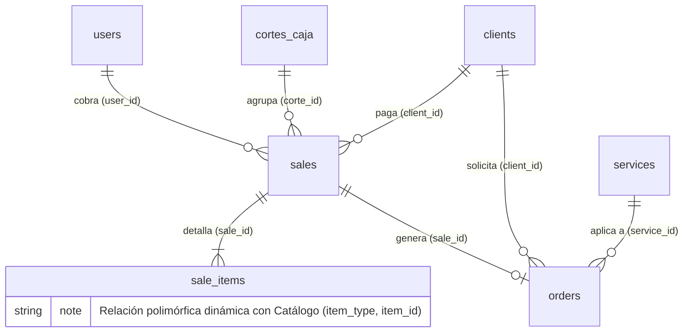

# Módulo 3: Ventas y Pedidos (POS)

Este módulo representa el núcleo transaccional del Punto de Venta (POS). Se
encarga de registrar todos los ingresos operativos del sistema, ya sean ventas
de flujo inmediato (mostrador) o pedidos a futuro (encargos). Su diseño
garantiza la **inmutabilidad financiera** (histórico de precios) y prepara el
terreno para la facturación electrónica.

---

# Diagrama de Entidades



---

# Diccionario de Datos

## 1. Tabla: `sales`

Es la cabecera transaccional. Registra el evento de cobro, vinculándolo con el
cajero, el turno (corte de caja) y el cliente. Contiene los datos necesarios
para generar un ticket o una factura fiscal.

| Campo            | Tipo de Dato          | Modificadores / Llaves          | Descripción                                                                |
| ---------------- | --------------------- | ------------------------------- | -------------------------------------------------------------------------- |
| `id`             | `bigint(20) unsigned` | PK, AUTO_INCREMENT              | Identificador único de la venta.                                           |
| `user_id`        | `bigint(20) unsigned` | FK (`users.id`), NULLABLE       | Cajero o usuario que procesó el cobro de la venta.                         |
| `corte_id`       | `bigint(20) unsigned` | FK (`cortes_caja.id`), NULLABLE | Turno activo en el que se registró esta venta.                             |
| `reference`      | `varchar(20)`         | NOT NULL, UNIQUE                | Folio alfanumérico público de la venta (ej. para el ticket).               |
| `client_id`      | `bigint(20) unsigned` | FK (`clients.id`), NULLABLE     | Cliente al que se le realizó la venta (opcional para ventas de mostrador). |
| `total`          | `decimal(10,2)`       | NOT NULL                        | Importe monetario total cobrado.                                           |
| `payment_method` | `varchar(30)`         | NOT NULL                        | Método de pago principal (ej. Efectivo, Tarjeta, Transferencia).           |
| `payment_form`   | `varchar(5)`          | NULLABLE                        | Clave de la forma de pago del SAT (ej. `01`, `04`).                        |
| `facturapi_id`   | `varchar(255)`        | NULLABLE                        | Identificador de la factura generada mediante Facturapi.                   |
| `billed_at`      | `date`                | NULLABLE                        | Fecha en la que se generó la factura.                                      |
| `status`         | `varchar(20)`         | NOT NULL, DEFAULT `'pagado'`    | Estado actual de la venta (ej. `pagado`, `cancelado`).                     |
| `created_at`     | `timestamp`           | NULLABLE                        | Fecha y hora en la que se completó la transacción.                         |
| `updated_at`     | `timestamp`           | NULLABLE                        | Fecha de última modificación.                                              |

---

## 2. Tabla: `sale_items`

Detalle de los conceptos cobrados en una venta. Está diseñada para ser
**inmutable**, aislando el historial contable de cualquier cambio futuro en los
catálogos.

| Campo            | Tipo de Dato          | Modificadores / Llaves             | Descripción                                                           |
| ---------------- | --------------------- | ---------------------------------- | --------------------------------------------------------------------- |
| `id`             | `bigint(20) unsigned` | PK, AUTO_INCREMENT                 | Identificador único de la partida.                                    |
| `sale_id`        | `bigint(20) unsigned` | FK (`sales.id`), ON DELETE CASCADE | Venta a la que pertenece esta partida.                                |
| `item_type`      | `varchar(255)`        | NOT NULL, INDEX                    | Espacio de nombres del modelo polimórfico (ej. `App\Models\Service`). |
| `item_id`        | `bigint(20) unsigned` | NOT NULL, INDEX                    | Identificador (`id`) del modelo referenciado en `item_type`.          |
| `name_snapshot`  | `varchar(100)`        | NOT NULL                           | **Instantánea:** nombre del ítem al momento exacto de la venta.       |
| `price_snapshot` | `decimal(10,2)`       | NOT NULL                           | **Instantánea:** precio unitario cobrado al momento de la venta.      |
| `quantity`       | `int(11)`             | NOT NULL, DEFAULT `1`              | Cantidad de unidades vendidas.                                        |
| `subtotal`       | `decimal(10,2)`       | NOT NULL                           | Resultado de `price_snapshot × quantity`.                             |

---

## 3. Tabla: `orders`

Gestiona los servicios de lavandería que requieren procesamiento a lo largo del
tiempo (encargos). Funciona en paralelo a una venta y hereda su comportamiento
financiero.

| Campo             | Tipo de Dato          | Modificadores / Llaves                           | Descripción                                                                    |
| ----------------- | --------------------- | ------------------------------------------------ | ------------------------------------------------------------------------------ |
| `id`              | `bigint(20) unsigned` | PK, AUTO_INCREMENT                               | Identificador único del pedido.                                                |
| `reference`       | `varchar(20)`         | NULLABLE, UNIQUE                                 | Folio público y de seguimiento del pedido.                                     |
| `sale_id`         | `bigint(20) unsigned` | FK (`sales.id`), UNIQUE, ON DELETE CASCADE       | Venta asociada al pedido (relación 1:1 obligatoria).                           |
| `client_id`       | `bigint(20) unsigned` | FK (`clients.id`), NULLABLE, ON DELETE SET NULL  | Cliente dueño de las prendas.                                                  |
| `service_id`      | `bigint(20) unsigned` | FK (`services.id`), NULLABLE, ON DELETE SET NULL | Servicio específico que se procesará.                                          |
| `quantity`        | `decimal(8,2)`        | NOT NULL, DEFAULT `0.00`                         | Peso o cantidad sujeta a proceso (ej. kilos de ropa).                          |
| `details`         | `varchar(255)`        | NULLABLE                                         | Notas adicionales del cliente o de las prendas recibidas.                      |
| `total_price`     | `decimal(10,2)`       | NOT NULL                                         | Costo total calculado para el servicio.                                        |
| `advance_payment` | `decimal(10,2)`       | NOT NULL, DEFAULT `0.00`                         | Anticipo dejado por el cliente.                                                |
| `status`          | `varchar(20)`         | NOT NULL, DEFAULT `'pendiente'`                  | Estado operativo del pedido (`pendiente`, `en proceso`, `listo`, `entregado`). |
| `arrival_date`    | `datetime`            | NOT NULL, DEFAULT `CURRENT_TIMESTAMP`            | Fecha de recepción de las prendas.                                             |
| `delivery_date`   | `datetime`            | NULLABLE                                         | Fecha programada o real de entrega.                                            |
| `created_at`      | `timestamp`           | NULLABLE                                         | Fecha de creación del registro.                                                |
| `updated_at`      | `timestamp`           | NULLABLE                                         | Fecha de última modificación operativa.                                        |

---

# Lógica de Modelos (Eloquent)

Los modelos de este módulo están fuertemente ligados para garantizar la
consistencia financiera. Utilizan eventos del ciclo de vida (`boot`), relaciones
polimórficas y bloqueos de base de datos para prevenir errores concurrentes.

---

## Modelo `Sale` (Cabecera)

### Generación Segura de Folios (Eventos `boot`)

El modelo sobrescribe el método `boot()` para interceptar el evento `creating`.

Durante este proceso:

- Asigna automáticamente el `user_id` del empleado autenticado que está
  realizando el cobro.
- Si el registro no cuenta con una referencia (`reference`), genera un folio
  consecutivo (por ejemplo, `BK-0001`).

### Concurrencia Segura

La generación del folio utiliza `lockForUpdate()` al consultar el último
registro.

Este bloqueo evita que dos cajeros obtengan el mismo folio cuando realizan un
cobro exactamente al mismo tiempo, garantizando que cada venta reciba un
identificador único incluso en escenarios de alta concurrencia.

### Casteo y Relaciones

El modelo mantiene el atributo:

| Atributo | Cast        | Propósito                                        |
| -------- | ----------- | ------------------------------------------------ |
| `total`  | `decimal:2` | Garantiza precisión en los cálculos financieros. |

Además, define las relaciones principales del sistema:

- `user()` → Empleado responsable de la venta.
- `corte()` → Turno o corte de caja en el que se registró la venta.
- `items()` y `detalles()` → Conceptos asociados a la venta.

---

## Modelo `SaleItem` (Detalle)

### Optimización de Espacio

El modelo desactiva intencionalmente el manejo automático de fechas mediante:

```php
public $timestamps = false;
```

Esto se debe a que el momento exacto de la transacción ya queda registrado en la
cabecera (`Sale`), evitando almacenar información redundante y reduciendo
espacio en bases de datos con un alto volumen de operaciones.

### Cierre Polimórfico

El método:

```php
item()
```

retorna una relación `morphTo()`.

Con ello se completa el diseño polimórfico del sistema, permitiendo que Eloquent
resuelva automáticamente el modelo correspondiente (`Service`, `Supply` o
`Subscription`) utilizando los campos `item_type` e `item_id`.

---

## Modelo `Order` (Encargos a Futuro)

### Gestión de Tiempos

El modelo castea la columna:

| Atributo        | Cast       | Propósito                                                                                                 |
| --------------- | ---------- | --------------------------------------------------------------------------------------------------------- |
| `delivery_date` | `datetime` | Facilita el manejo de fechas en calendarios del frontend y la automatización de recordatorios de entrega. |

### Estricta Dependencia Financiera

El modelo establece relaciones explícitas que garantizan la consistencia entre
los pedidos y las ventas:

- `sale()` → Todo pedido pertenece obligatoriamente a una venta, permitiendo
  controlar anticipos y liquidaciones.
- `service()` → Identifica el servicio específico que será procesado.
- `client()` → Se mantiene como una relación opcional para permitir pedidos
  rápidos de mostrador sin necesidad de registrar un cliente.
