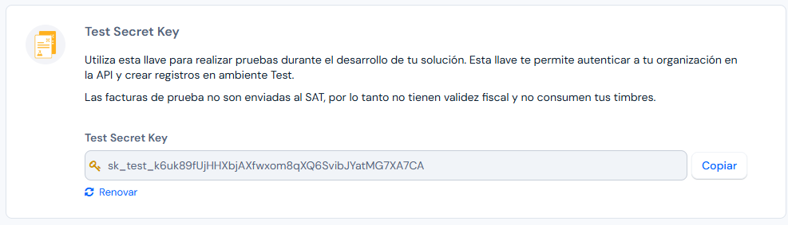
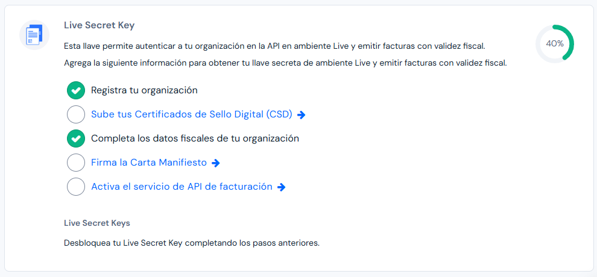
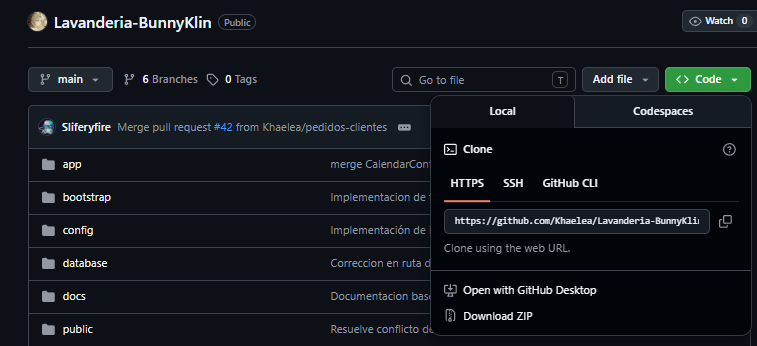
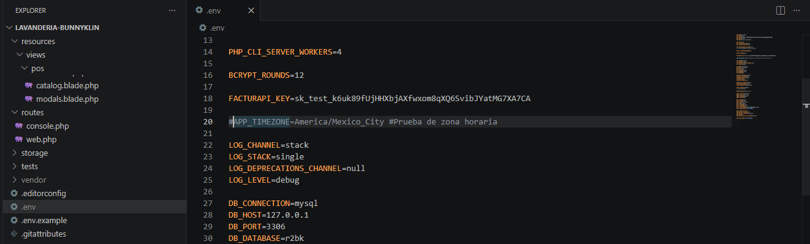
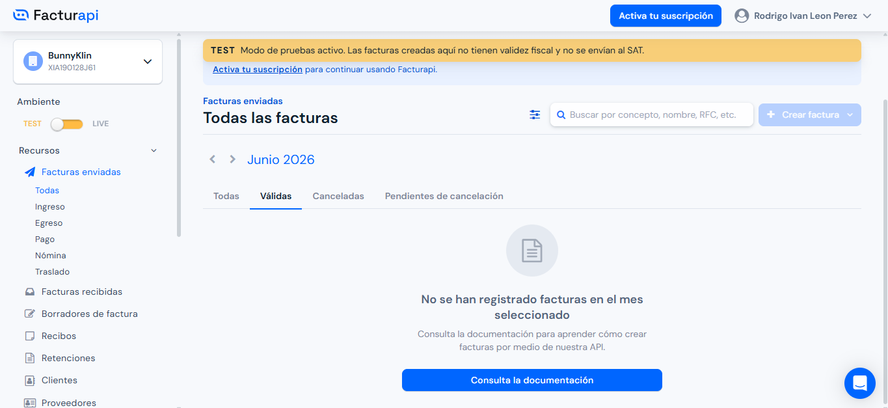
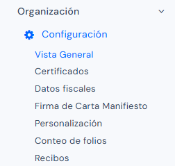
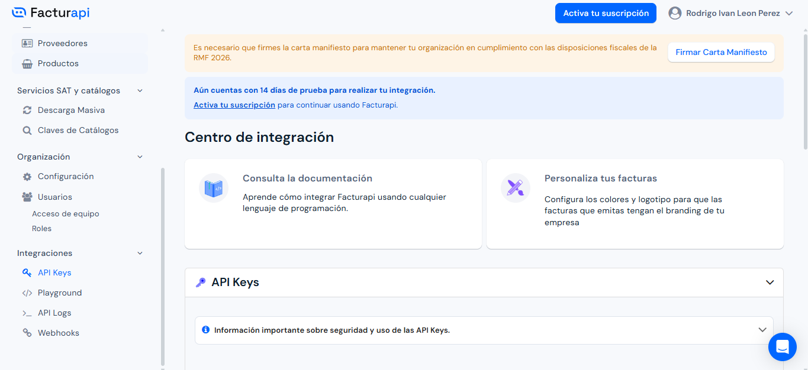

# Facturapi

## ¿Qué es?

Facturapi es un servicio web que permite interactuar con comprobantes fiscales digitales (CFDI) de una manera segura, simple y de bajo mantenimiento. Hacen uso de PCCFDI (antes PAC) autorizados por el SAT para timbrar tus facturas y darles validez fiscal.

## ¿Cómo funciona en conjunto con el sistema?

Facturapi es un servicio web que se comunica con tu sistema a través de una **API RESTful**. Esto significa que puedes usar cualquier lenguaje de programación para integrar tu servicio a Facturapi.

Las llamadas a la API de Facturapi se realizan desde tu servidor, por lo que no es necesario que tu cliente tenga una conexión directa con Facturapi. Los endpoints de la API están agrupados por recursos, tienen URLs predecibles, las respuestas tienen formato JSON y usamos códigos HTTP de respuesta, autenticación y verbos estándar.

## ¿Cómo se conecta al punto de venta?

El sistema se comunica con Facturapi por medio de la API oficial que nos proporciona el sitio web. Para realizar la modificación de la Key es necesario contar con los siguientes puntos:

- Cuenta de Facturapi
- Editor de Código (Es recomendado usar Visual Studio Code)
- Cuenta de GitHub


## Proceso para nuevos desarrolladores

### Dentro de Facturapi

1. Inicia sesión dentro de Facturapi.
2. En la pantalla principal el usuario tendrá acceso a dos diferentes keys:
   - **Test Secret Key:** Identifica a tu organización en el entorno de pruebas para crear y administrar recursos sin validez fiscal.

   

   - **Live Secret Key:** Es tu llave para el entorno real, necesaria para emitir facturas con validez oficial ante el SAT.

   

3. Copia el campo que aparece debajo de la Key que deseas utilizar.

### Dentro de GitHub

1. Entra dentro del repositorio del proyecto y busca el botón que menciona **"<> Code"** (de color verde claro).
2. Da clic y ubícate en la pestaña llamada **"Local"**.

<div align="center">

   

</div>

3. Dentro de la opción **"HTTPS"** existe una ruta acerca del repositorio; da clic en el icono del lado derecho donde se encuentra la URL para copiarlo en el portapapeles.

### Dentro del equipo (Computadora o Laptop)

1. Crea una carpeta dentro de tu computadora donde no exista ningún conflicto.
2. Entra por medio del explorador de archivos hasta la carpeta creada, da clic en la barra de ruta y escribe `cmd`, luego presiona Enter.
3. Se abrirá una consola de comandos donde deberás ingresar:

````bash
git clone (URL de GitHub)
````

> Reemplaza "URL de GitHub" por la URL copiada anteriormente (sin paréntesis). Presiona Enter para generar una copia del proyecto dentro de tu equipo.

### Dentro del Editor de Código

1. Abre el programa para editar código.
2. Busca la opción para abrir la carpeta donde has realizado la copia del proyecto.
3. Dentro del proyecto busca un archivo llamado `.env.example`, duplícalo y renómbralo como `.env`.
4. Busca la línea donde se menciona `FACTURAPI_KEY` y pega la Key copiada anteriormente de Facturapi.

<div align="center">

   

</div>

## Proceso de actualización de la API Key en el servidor

Este método permite modificar la llave de acceso de Facturapi de forma directa en el servidor donde se encuentra alojado el sistema. Es el procedimiento estándar en entornos de producción, ya que no requiere alterar archivos de código ni realizar despliegues desde GitHub, aplicando los cambios de manera inmediata.

### Paso 1: Obtención de la Live Secret Key en Facturapi

1. Inicie sesión en Facturapi.
2. En el menú lateral, acceda a la sección de **Integraciones** y seleccione el apartado **Api Keys**.
3. Asegúrese de estar en el entorno de producción (**Live**) e identifique el campo **"Live Secret Key"**.
4. Haga clic en el icono para revelar la clave oculta y cópiela en el portapapeles (las llaves de producción reales suelen iniciar con el prefijo `sk_live_`).

### Paso 2: Acceso al Administrador de Archivos de Hostgator

1. Inicie sesión en su cuenta de Hostgator y acceda al **cPanel** de su sitio web.
2. Dentro de la sección de herramientas principales, localice y abra la opción **"Administrador de Archivos"** (File Manager).
3. En el menú izquierdo, busque la carpeta raíz donde se encuentra instalado el proyecto Laravel (generalmente en la carpeta raíz del usuario o dentro de `public_html`, dependiendo de la configuración del hosting).

### Paso 3: Modificación del Archivo de Entorno (.env)

1. Dentro de la carpeta del proyecto, busque el archivo llamado `.env`.

   > **Nota importante:** Al ser un archivo oculto (por iniciar con un punto), si no lo visualiza, haga clic en el botón **"Configuración"** (Settings) en la esquina superior derecha del Administrador de Archivos de cPanel, marque la casilla **"Mostrar archivos ocultos (dotfiles)"** y guarde los cambios.

2. Seleccione el archivo `.env` y haga clic en la opción **"Editar"** (Edit) en la barra de herramientas superior. Si aparece una ventana de confirmación de codificación de texto, presione el botón **"Edit"** nuevamente.
3. Busque la línea de código donde se menciona la variable `FACTURAPI_KEY`.
4. Reemplace la clave anterior (o la de pruebas) pegando la **Live Secret Key** que copió desde el panel de Facturapi, justo después del signo de igual (`=`).
5. Haga clic en el botón **"Guardar cambios"** (Save Changes) ubicado en la esquina superior derecha del editor y cierre la ventana.

### Paso 4: Limpieza de la caché del framework

En los entornos de hosting compartido como Hostgator, no siempre se tiene acceso a una terminal de comandos (SSH) para limpiar la caché de Laravel. Si nota que el sistema sigue usando la llave anterior, use uno de los siguientes métodos para forzar la actualización:

**Método A (Si tiene acceso a la Terminal en cPanel):**

Busque la herramienta "Terminal" en cPanel, ingrese a la ruta del proyecto con:

````bash
cd nombre_de_tu_carpeta
````

Y ejecute:

````bash
php artisan config:clear
````

**Método B (Ruta temporal en el navegador):**

Si no tiene terminal, abra temporalmente el archivo de rutas de Laravel (`routes/web.php`) en el cPanel, agregue las siguientes líneas al final del archivo:

````php
Route::get('/limpiar-cache', function() {
    Artisan::call('config:clear');
    return 'Caché de configuración eliminada con éxito';
});
````

Y visite la URL `tudominio.com/limpiar-cache` desde su navegador.

> Una vez completado el proceso y verificada la limpieza de la caché, el punto de venta en Hostgator comenzará a emitir de manera formal las facturas oficiales ante el SAT.

---

## Funciones del sitio web (Facturapi)

En el sitio web de Facturapi existen distintos apartados con diferentes funciones. Algunas de ellas pueden ser funcionales en casos importantes o a futuro:

### Facturas Enviadas

En la sección de **Recursos** se encuentra el apartado de **Facturas Enviadas**, donde se encontrarán todas las facturas que se han generado (tanto facturas individuales como facturas globales). Al entrar en cada una de ellas se pueden ver los detalles y opciones para descargar o compartir con algún usuario por medio de correo electrónico.

<div align="center">

   

</div>

### Configuración

En la sección de **Organización** encontramos la opción de **Configuración**, dividida en los siguientes campos:

| Campo | Descripción |
|---|---|
| **Vista General** | Muestra los pasos y configuraciones necesarias para completar el proceso. |
| **Certificados** | Aquí debe subirse el Certificado del Sello Digital. |
| **Datos Fiscales** | Permite editar los campos fiscales del negocio; esta información es la que se recopila y muestra en las facturas generadas. |
| **Firma de Carta Manifiesto** | Sección en donde se autoriza al Proveedor Autorizado de Certificación (PAC) a certificar y entregar al SAT los CFDI que se emitan mediante la plataforma. |
| **Personalización** | Campos que pueden ser modificados como el logotipo, el color o edición de campos que pueden ser mostrados o no dentro de la factura. |

<div align="center">

   

</div>

### Api Keys

Dentro de la sección de **Integraciones** nos encontramos con el apartado de **Api Keys**, donde puedes encontrar las llaves de acceso para integrarlo dentro del programa.

<div align="center">

   

</div>