**MANUAL DE USUARIOS PARA BUNNYKLIN**  
**Versión 1.0**  
**25 de Junio de 2026**

**INTRODUCCIÓN**

Este manual tiene como objetivo guiar a los empleados en el uso del Punto de Venta (POV), explicando el uso de cada uno de los apartados, su funcionalidad y todas las operaciones necesarias para controlarlo.

**REQUISITOS DEL SISTEMA**

El Punto de Venta es un sistema disponible para acceder en todo momento y en cualquier lugar, para acceder al sistema es indispensable contar con:

* Dispositivo con acceso a internet (Teléfono, Laptop, Tablet, etc).  
* Navegador (Se puede acceder con cualquier navegador, por ejemplo Google, Microsoft Edge, Brave, etc).

**ACCESO AL SISTEMA**

El usuario puede acceder a la plataforma mediante el siguiente link: [https://bk.bunnyklin.com/signin](https://bk.bunnyklin.com/signin) 

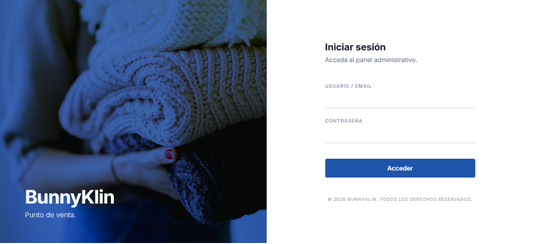

Esta es la pantalla del login principal, actualmente existe un único registro para acceder, siendo los siguientes campos:

* Usuario: [admin@bunnyklin.com](mailto:admin@bunnyklin.com)  
* Contraseña: 123456

**INTERFAZ**  
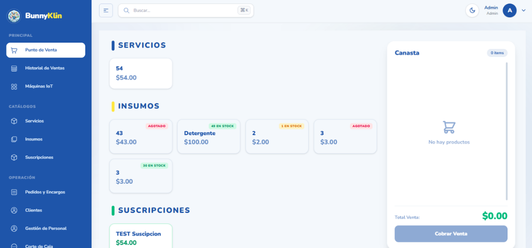

Al iniciar sesión correctamente pasará a visualizar la interfaz completa, esta misma se compone de distintos elementos;

1. **Menú Lateral:** Es el menú que permite navegar entre los distintos apartados del sistema, en la parte superior contiene el nombre del negocio junto con el logotipo. Este mismo puede ocultarse con el botón que se encuentra al lado derecho.  
2. **Área de Trabajo:** Es la parte donde se muestra la información de todos los apartados y la única que cambiará al cambiar entre los distintos apartados.  
3. **Perfil:** Indica la cuenta con la que se accedió, menciona el nombre del usuario y permite cerrar sesión al dar clic en el icono del nombre y seleccionando “Cerrar Sesión”.

   
**APARTADOS**

Como se mencionó anteriormente, el punto de venta se compone de distintos apartados, cada uno tiene una funcionalidad y opciones distintas que conforman la funcionalidad. En el menú lateral los apartados se dividen en 3 partes, Principales, Catálogos y Operación.

**PRINCIPALES**

1. **Punto de Venta**

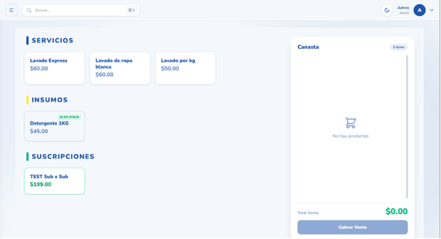

Es la pantalla principal que se visualiza al iniciar sesión. En este se realizan las ventas de los productos, servicios y suscripciones que el negocio maneja, las ventas pueden ser por medio de pago en efectivo y pago con tarjeta (Este último deberá usar la terminal de Mercado Pago para realizarse).

2. **Historial de Ventas**

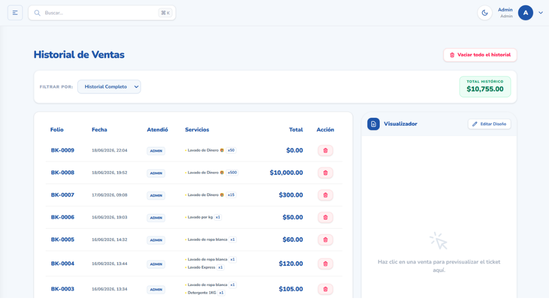

Funciona para visualizar las ventas realizadas, sean recientes o anteriores: Pueden filtrarse según sean las necesidades y permite visualizar y eliminar los registros.

3. **Máquinas IoT**

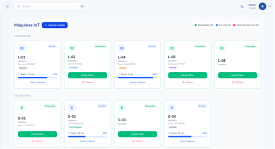

Es un apartado que se enfoca en monitorear el estado de tus equipos, el usuario puede ver el estado en el que se encuentran, el tiempo restante y añadir, editar o eliminar nuevos equipos.

**CATÁLOGOS**

Los apartados que se encuentran dentro de esta parte tienen una funcionalidad parecida, permitiendo añadir, editar, visualizar o eliminar los registros que se encuentren, pueden ser configurados para ser visibles o no visibles para el apartado de punto de venta, pero se diferencian por el uso que tienen. 

1. **Servicios**

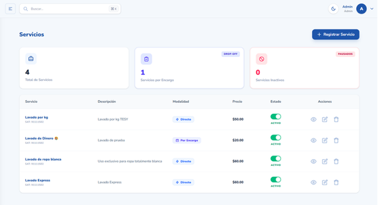

Dentro de este apartado se administran los distintos servicios que el negocio ofrece, sean servicios para el establecimiento o servicios para pedidos y clientes externos.

2. **Insumos**

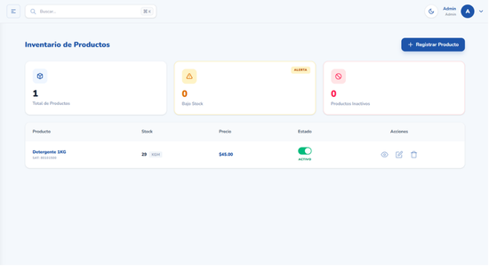

En este apartado se administran los distintos productos que el negocio ofrece a los clientes, tanto productos para lavado (Detergente, Blanqueadores, etc.), como productos consumibles (Papas, Bebidas, etc).

3. **Suscripciones**

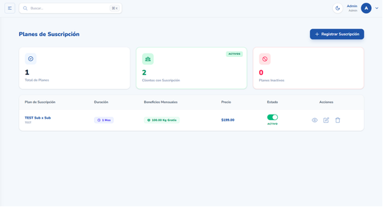

Por último, este apartado administra las suscripciones que se manejan, pueden durar por varios meses y con distintas cantidades de lavado disponibles.

   
**OPERACIÓN**

Esta última parte concentra los apartados enfocados en operaciones más específicas con un uso más bajo.

1. **Pedidos y Encargos**

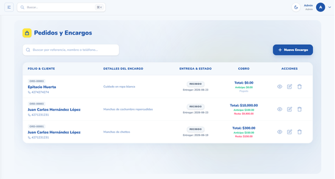

Dentro de este apartado se realizarán las ventas por pedido o encargo, los servicios registrados como encargos serán los únicos que aparecerán para ser vendidos.

2. **Clientes**

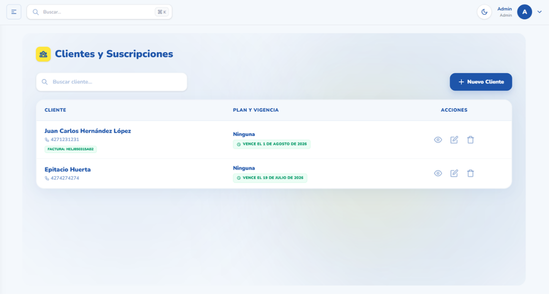

En este apartado el usuario puede administrar a los clientes que han sido registrados a partir de la venta de una suscripción, en este mismo pueden ser registrados con sus datos en caso de requerir factura.

3. **Gestión de Personal**

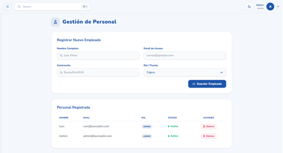

En este apartado se pueden administrar los distintos usuarios que tengan acceso al Punto de Venta, pueden ser registrados con un rol de administradores o empleados para limitar su acceso a distintas funciones. 

4. **Corte de Caja**

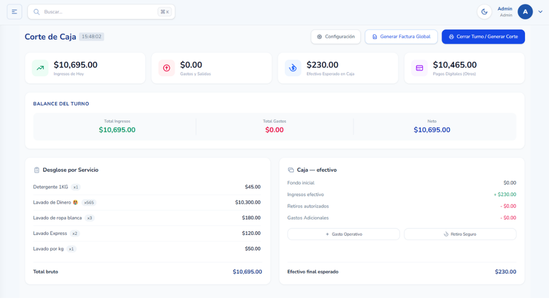

Este apartado proporciona un control para el corte de caja, con el cual pueden recopilar las ventas, gastos y retiros que sucedan durante el turno del empleado. El usuario puede generar una factura global dentro de este mismo apartado y ver el historial de los distintos cortes que se hayan realizado en el sistema.

5. **Calendario**

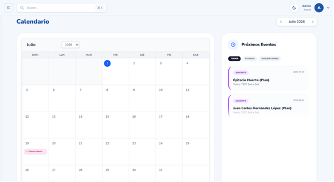

Funciona como un recurso visual para llevar el seguimiento de las fechas próximas en los pedidos y en las fechas de expiración de las suscripciones.

6. **Facturación**

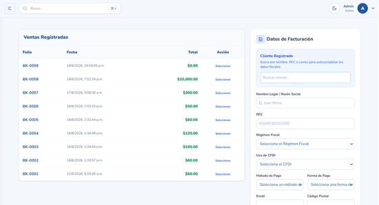

En este último se enfoca en generar facturas para el cliente en caso de requerir, la factura se genera seleccionando una venta y un cliente.

**FUNCIONES PRINCIPALES**

El Punto de Venta se conforma de distintas funciones que al inicio pueden ser complejas de comprender, por ello en esta sección nos enfocaremos en explicar las operaciones de uso diario.

**CÓMO GENERAR UNA VENTA**

1. Ingresa al apartado de Punto de Venta.  
2. Selecciona el servicio, productos que desea el cliente.   
3. Revisa que los servicios y productos seleccionados en la canasta, dentro de esta pueden aumentar o disminuir la cantidad o eliminar el producto de la cuenta.

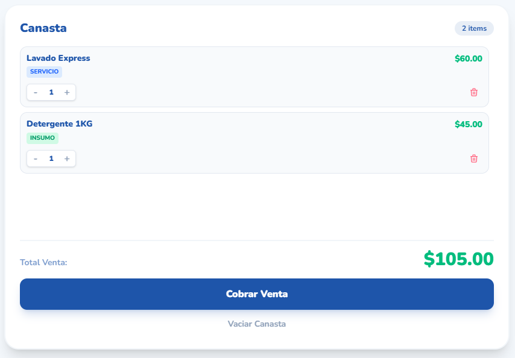

4. Da Clic en el botón de Cobrar Venta.  
5. Selecciona el método de pago.

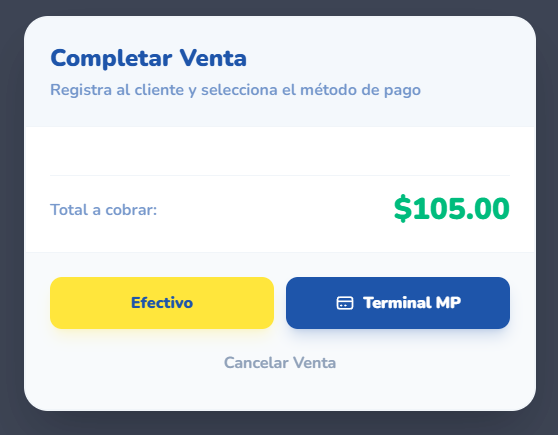

6. Al seleccionar el método de pago genera la venta y aparecerá un mensaje donde menciona “\!Venta Exitosa¡”, seguido de ello da clic en Nueva Venta para regresar a la pantalla inicial.

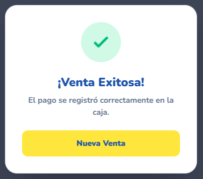

**CÓMO GENERAR UNA VENTA DE SUSCRIPCIÓN**

1. Ingresa al apartado de Punto de Venta.  
2. Selecciona la suscripción que el cliente desee.  
3. Da Clic en el botón de Cobrar Venta.  

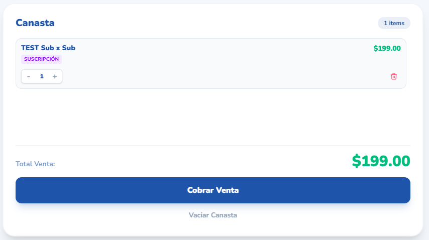

4. Aparecerá una ventana donde primero se deberán de rellenar los siguientes campos con los datos del cliente.  
* ¿Para quién es la suscripción? Esta opción permite seleccionar si el cliente que compra la suscripción es nuevo o ya se encuentra registrado en el sistema (En el segundo caso solo es necesario seleccionar el cliente y puede proseguir con el siguiente paso).  
* Nombre Completo.  
* Teléfono.  
* Correo Electrónico.  
* Inicio de Plan: Es un campo que se genera en automático y no es editable  

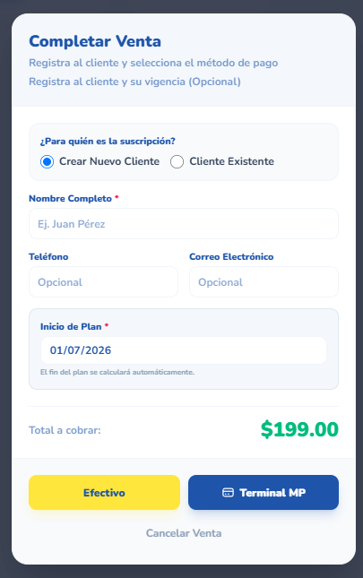

5. Al terminar de llenar los campos selecciona el método de pago.  
6. Al seleccionar el método de pago genera la venta y aparecerá un mensaje donde menciona “\!Venta Exitosa¡”, seguido de ello da clic en Nueva Venta para regresar a la pantalla inicial.

**CÓMO EDITAR LOS CAMPOS DEL TICKET QUE SE GENERA.**

1. Entra al apartado de Historial de Ventas.  
2. Selecciona alguna venta (no importa la venta que se seleccione).  
3. Ubícate en la parte del Visualizador y da clic en Editar Diseño.  
4. El ticket que se muestra entrará en modo de edición, dónde pueden editarse los siguientes campos:  
* Logotipo: Puede subirse un logotipo, pero es opcional.  
* Nombre del Negocio.  
* Dirección: Dirección del negocio.  
* Teléfono: Teléfono del negocio.  
* RFC o info. Extra: Puede ingresar el RFC del negocio o una información extra que se guste añadir.  
* Leyenda: En la parte inferior se puede cambiar la leyenda del ticket acerca de lo que quiera decir.  

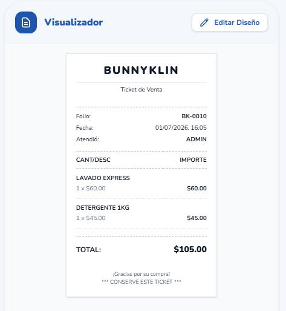

5. Al terminar de editar da clic en Guardar Diseño para terminar la edición.

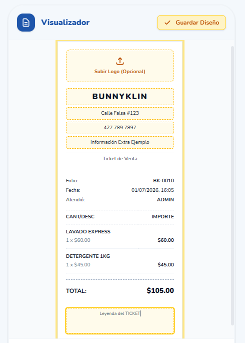

**CÓMO REGISTRAR UN SERVICIO**

1. Entra al apartado de Servicios.  
2. Selecciona el botón de Registrar Servicio.  

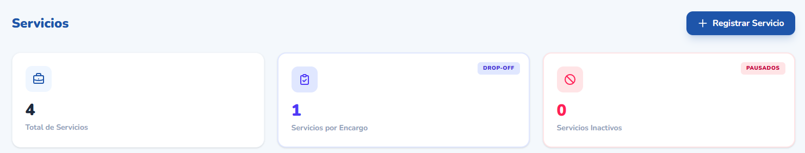

3. Se abrirá un formulario que deberá de rellenarse con los siguientes campos:  
* Elemento Activo: Permite seleccionar si el servicio aparecerá en el apartado de Punto de Venta.  
* Nombre.  
* Clave SAT: Se registra la clave del servicio que se ofrece, esta clave debe corresponder con un servicio del SAT, en caso de ser errónea generará conflicto al momento de facturar.  
* Precio.  
* Descripción: Detalles acerca del servicio.  
* Este servicio es por encargo: Campo seleccionable que menciona que el servicio que se registra es para venta en el establecimiento o para encargo.  

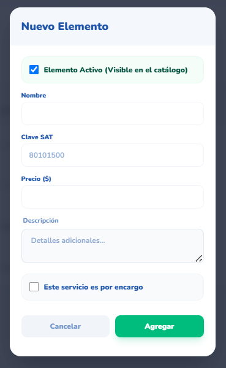

4. Al completar los campos da clic en el botón de Agregar para finalizar el registro. 

**CÓMO EDITAR UN SERVICIO**

1. Entra al apartado de Servicios.  
2. La tabla de Servicios se compone de distintas columnas, ubicate en la columna de Acciones y selecciona la opción de en medio (Tiene la forma de un lápiz). 

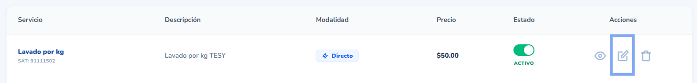

3. Abrirá un formulario con los campos disponibles a editar, son los mismos campos que se rellenaron para registrarlo.  

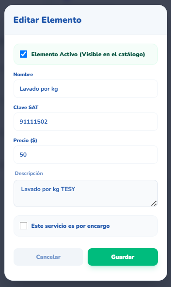

4. Al terminar de editar da clic en el botón de Guardar para terminar la edición.

**CÓMO ELIMINAR UN SERVICIO**

1. Entra al apartado de Servicios.  
2. La tabla de Servicios se compone de distintas columnas, ubicate en la columna de Acciones y selecciona la última opción(Tiene forma de bote de basura).  

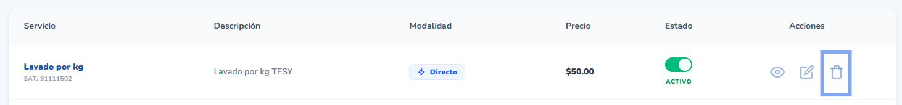

3. Al dar clic se mostrará un mensaje de advertencia mencionando que si deseas eliminar el servicio, da clic en Sí, Eliminar para eliminarlo del sistema

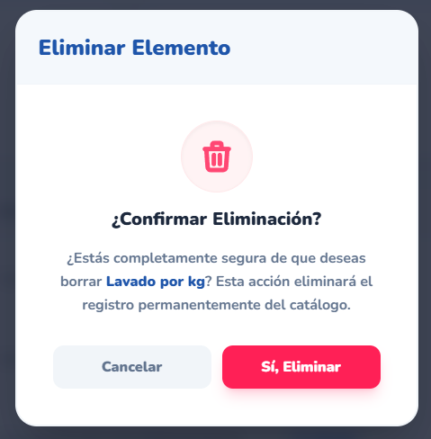

**CÓMO REGISTRAR UN PRODUCTO**

1. Entra al apartado de Insumos  
2. Selecciona el botón de Registrar Producto. 

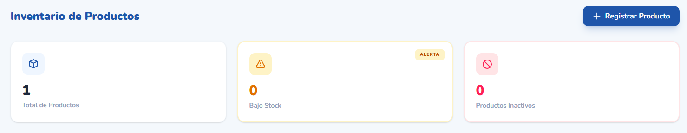

3. Se abrirá un formulario que debe ser rellenado con lo siguientes campos:  
* Elemento Activo: Permite seleccionar si el producto aparecerá en el apartado de Punto de Venta.  
* Nombre.  
* Clave SAT: Se registra la clave del producto que se ofrece, esta clave debe corresponder con el producto registrado en el SAT, en caso de ser errónea generará conflicto al momento de facturar.  
* Precio.  
* Stock: Indica la cantidad de productos disponibles que tendrán.  
* Unidad de Medida: Selecciona la unidad de medida con la que se venderá el producto.  

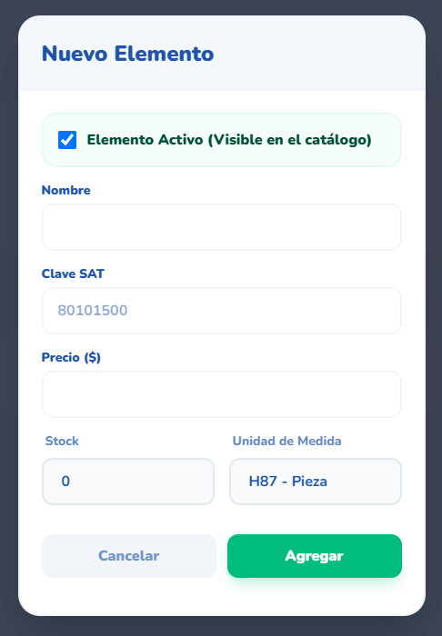

4. Al completar los campos da clic en Agregar para registrarlo.

**CÓMO EDITAR UN PRODUCTO**

1. Entra al apartado de Insumos.  
2. La tabla de insumos se encuentra dividida en diferentes columnas, ubicate en la columna de Acciones y selecciona la segunda opción (Tiene forma de lapíz).  

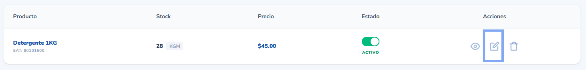

3. Se abrirá un formulario similar al de registro donde se puede editar los campos.  

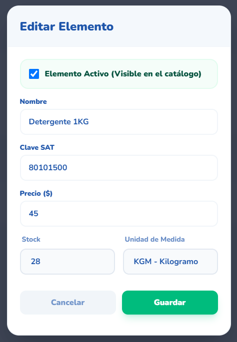

4. Al terminar de editar da clic en el botón de Guardar para terminar la edición.

**CÓMO ELIMINAR UN PRODUCTO**

1. Entra al apartado de Insumos.  
2. La tabla de insumos se encuentra dividida en diferentes columnas, ubicate en la columna de Acciones y selecciona la última opción(Tiene forma de bote de basura).  

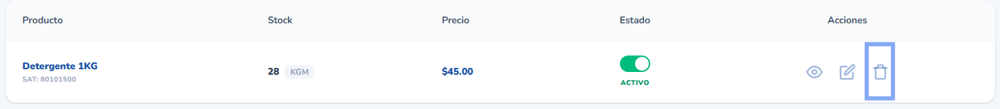

3. Se mostrará un mensaje de advertencia que menciona que el registro se eliminará del sistema, da clic en Sí, Eliminar para borrar el registro del sistema.

**CÓMO REGISTRAR UNA SUSCRIPCIÓN**

1. Entra al apartado de Suscripciones.  
2. Da clic en el botón de Registrar Suscripción.  

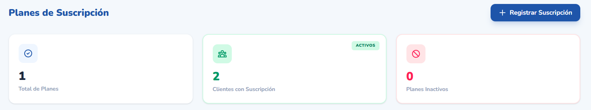

3. Se abrirá un formulario que debe ser rellenado con los siguientes campos:  
* Elemento Activo: Permite seleccionar si el producto aparecerá en el apartado de Punto de Venta.  
* Nombre.  
* Clave SAT: Se registra la clave del producto que se ofrece, esta clave debe corresponder con el producto registrado en el SAT, en caso de ser errónea generará conflicto al momento de facturar.  
* Precio.  
* Descripción: Detalles acerca de la función o beneficios que tendrá la suscripción.  
* Duración: Las duración que tendrá se maneja por meses, se debe ingresar el número de meses que le corresponda.  
* Kilos Gratis al Mes: Se especifica los kilos que la suscripción ofrece al cliente.  

4. Al completar el formulario da clic en el botón de Agregar para registrarlo.

**CÓMO EDITAR UNA SUSCRIPCIÓN**

1. Entra al apartado de Suscripciones.  
2. La tabla de Suscripciones se conforma de varias columnas, ubicate en la columna de Acciones y da clic en la segunda opción(Tiene forma de lapíz).  

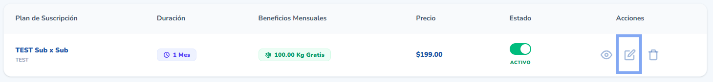

3. Se abrirá un formulario similar al de registro donde se puede editar los campos.  

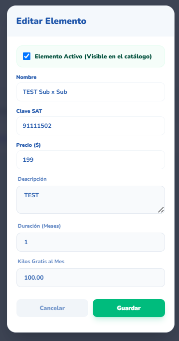

4. Al terminar de editar da clic en el botón de Guardar para terminar la edición.

**CÓMO ELIMINAR UNA SUSCRIPCIÓN**

1. Entra al apartado de Suscripciones.  
2. La tabla de Suscripciones se encuentra dividida en diferentes columnas, ubicate en la columna de Acciones y selecciona la última opción(Tiene forma de bote de basura).  

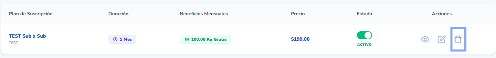

3. Se mostrará un mensaje de advertencia que menciona que el registro se eliminará del sistema, da clic en Sí, Eliminar para borrar el registro del sistema.

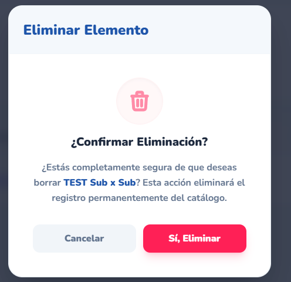

**CÓMO REGISTRAR UNA VENTA POR PEDIDO**

1. Entra al apartado de Pedidos y Encargos.  
2. Da clic en el botón de Nuevo Encargo.  

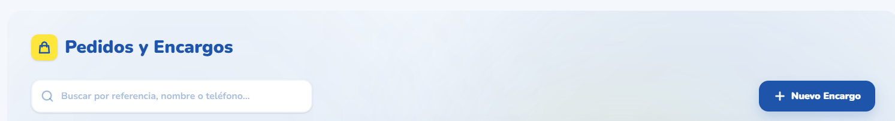

3. Se abrirá un formulario que es necesario rellenar por completo con los siguientes campos:  
* El cliente ya está registrado: Una opción que permite seleccionar un cliente existente en el sistema, en caso de que ya se encuentre registrado completará los campos de Nombre del Cliente, Teléfono y mencionara la suscripción que tiene, al igual que los kilos que le restan con la suscripción.  
* Nombre del Cliente.  
* Télefono.  
* Tipo de Servicio: Opción Seleccionable para indicar el servicio que el cliente requiere.  
* Kilos / Piezas: Menciona la cantidad de Piezas o Kilos que tiene el pedido del cliente.  
* Detalles Especiales o Notas: Menciona detalles de cómo tratar ciertos productos o si debe llevar un cuidado.  
* Costo Total: Es un campo que se rellena en automático.  
* Adelanto: Menciona la cantidad que el cliente está pagando por adelantado.  
* Estado del Lavado: Menciona el estado del pedido del cliente.  
* Fecha de Llegada: Se completa en automático con la fecha actual del sistema.  
* Fecha de Entrega.  

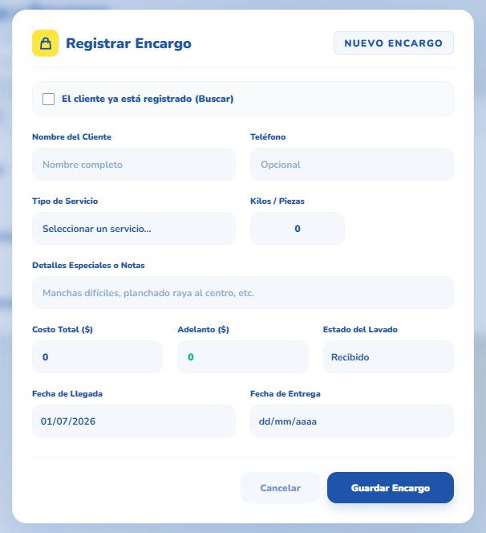

4. Al completar de rellenar los campos da clic en Guardar Encargo para registrarlo.

**CÓMO EDITAR UN PEDIDO**

5. Entra al apartado de Pedidos y Encargos.  
6. La tabla de Pedidos se conforma de varias columnas, ubicate en la columna de Acciones y da clic en la segunda opción(Tiene forma de lapíz).

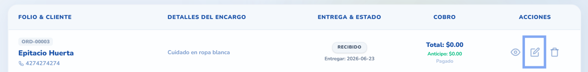

7. Se abrirá un formulario similar al de registro donde se puede editar los campos.  

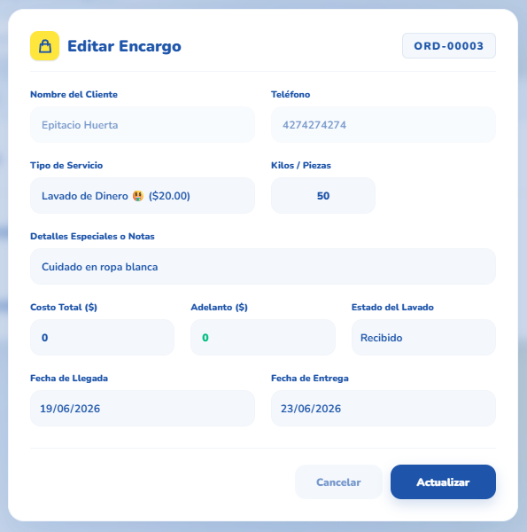

8. Al terminar de editar da clic en el botón de Actualizar para terminar la edición.

**CÓMO ELIMINAR UNA SUSCRIPCIÓN**

4. Entra al apartado de Pedidos y Encargos.  
5. La tabla de Pedidos se encuentra dividida en diferentes columnas, ubicate en la columna de Acciones y selecciona la última opción(Tiene forma de bote de basura). 

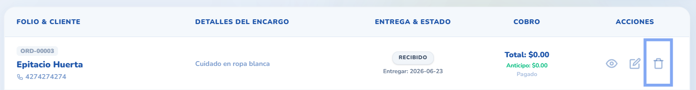

6. Se mostrará un mensaje de advertencia que menciona que el registro se eliminará del sistema, da clic en Aceptar para borrar el registro del sistema.

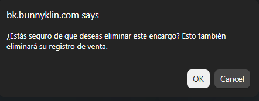

**CÓMO REGISTRAR UN NUEVO CLIENTE**

1. Entra al apartado de Clientes.  
2. Da clic en el botón de Nuevo Cliente.  

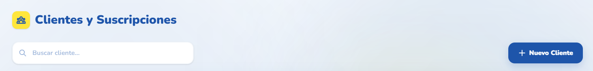

3. Se abrirá un formulario que debe de rellenarse por completo con los siguientes campos:  
* Nombre del Cliente.  
* Teléfono.  
* Correo Electrónico.  
* Plan de Suscripción: Selecciona la suscripción que el cliente solicite.  
* Calle: Mencionar la calle donde debe llevarse el pedido.  
* N° Ext: Número externo de la ubicación.  
* N° Int: Número interno de la ubicación.  
* Colonia: Colonia donde se ubica.  
* Ciudad / Municipio.  
* C.P: Código Postal del Cliente.  
* Estado: Menciona el estado en el que se encuentra el cliente.  
* El Cliente Requiere Factura: Es una opción seleccionable que menciona si el cliente requiere o no facturar. 

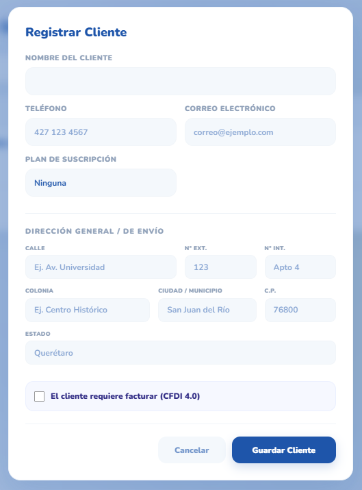

En caso de ser seleccionada se mostrarán los siguientes campos:

* Razón Social: Mencionar el Nombre completo del cliente.  
* RFC: RFC del cliente.  
* Régimen Fiscal: Seleccionar el régimen fiscal del cliente.  
* La dirección fiscal es igual a la operativa: Campo seleccionable para mencionar que los campos de dirección de la parte superior son iguales a para facturar.  
* Calle Fiscal: Mencionar la calle de ubicación fiscal.  
* N° Ext: Mencionar el número de la ubicación fiscal.  
* N° Int: Mencionar el número de la ubicación fiscal.  
* Colonia Fiscal: Mencionar la colonia de la ubicación fiscal.  
* Ciudad / Municipio: Mencionar la ciudad o municipio de la ubicación fiscal.  
* C.P Fiscal: Mencionar el código postal de la ubicación fiscal.  
* Estado Fiscal: Mencionar el estado de la ubicación fiscal. 

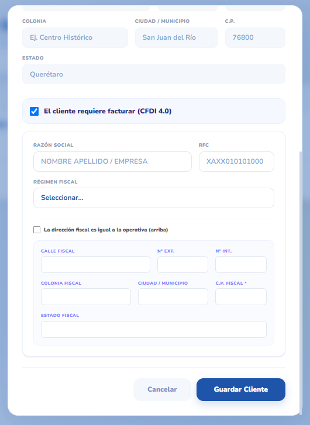

4. Al terminar de rellenar los campos da clic en el botón de Guardar Cliente para registrarlo.

**CÓMO EDITAR UN CLIENTE**

1. Entra al apartado de Clientes.  
2. La tabla de Clientes se conforma de varias columnas, ubicate en la columna de Acciones y da clic en la segunda opción(Tiene forma de lapíz).  

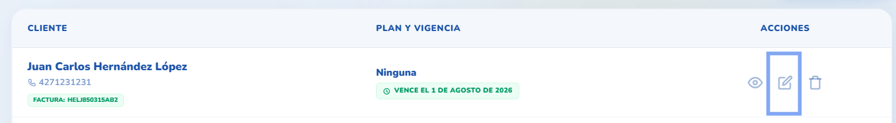

3. Se abrirá un formulario similar al de registro donde se puede editar los campos.  

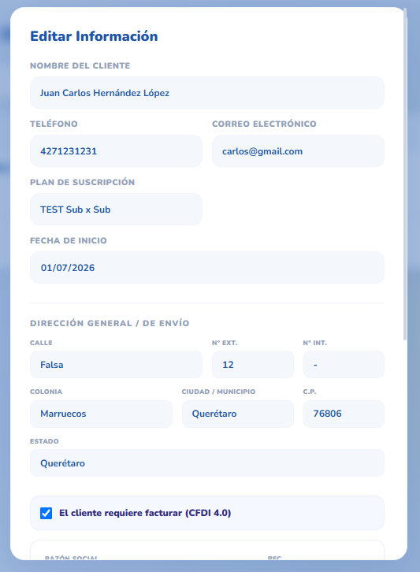

4. Al terminar de editar da clic en el botón de Actualizar Cliente para terminar la edición.

**CÓMO ELIMINAR UN CLIENTE**

1. Entra al apartado de Clientes.  
2. La tabla de Clientes se encuentra dividida en diferentes columnas, ubicate en la columna de Acciones y selecciona la última opción(Tiene forma de bote de basura).  

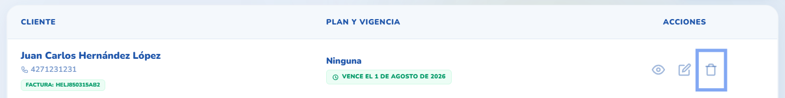

3. Se mostrará un mensaje de advertencia que menciona que el registro se eliminará del sistema, da clic en Aceptar para borrar el registro del sistema.

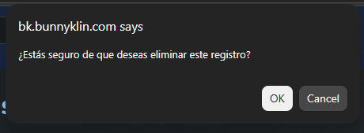

**CÓMO REGISTRAR UN NUEVO EMPLEADO**

1. Entra al apartado de Gestión del Personal.  
2. Se muestra en la parte superior un formulario que debe rellenarse con los siguientes campos:  
* Nombre Completo.  
* Email de Acceso.  
* Contraseña.  
* Rol / Puesto.  

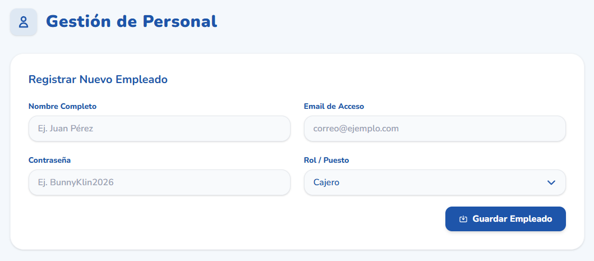

3. Da clic en el botón de Guardar Empleado para registrarlo.  
4. Dentro de HostGator debe de entrar al apartado de correos para buscar un correo que se genera para confirmar el acceso del nuevo empleado.  
5. Al confirmar la petición se puede acceder al sistema con el email y contraseña generados.

 **CÓMO ELIMINAR UN EMPLEADO**

1. Entra al apartado de Gestión del Personal.  
2. En la tabla de Personal Registrado ubica la columna de acciones y da clic en el botón de Eliminar.  

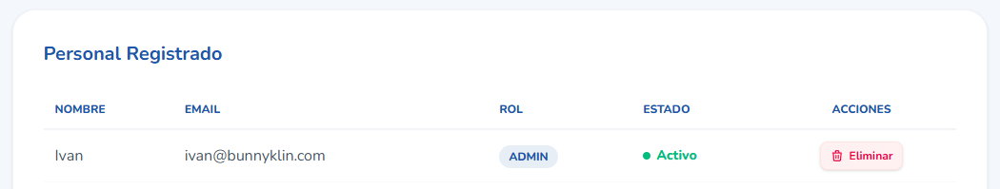

3. Mostrará un mensaje de aviso para confirmar si se desea eliminar el perfil, da clic en Eliminar para borrarlo del sistema.

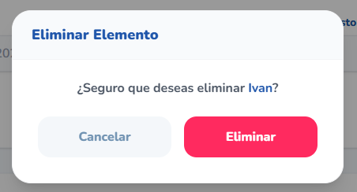

**CÓMO REALIZAR EL CORTE DE CAJA**

1. Entra al apartado de Corte de Caja.  
2. Da Clic en el botón de Cerrar Turno / Generar Corte.

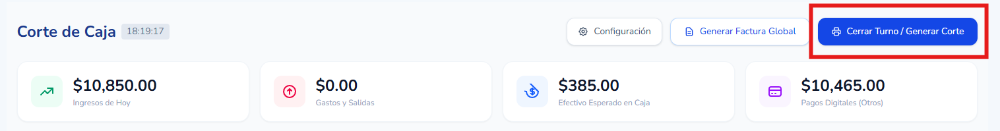

3. Abrirá un formulario donde se puede indicar la cantidad de billetes que tiene el empleado en caja de diferente valor.

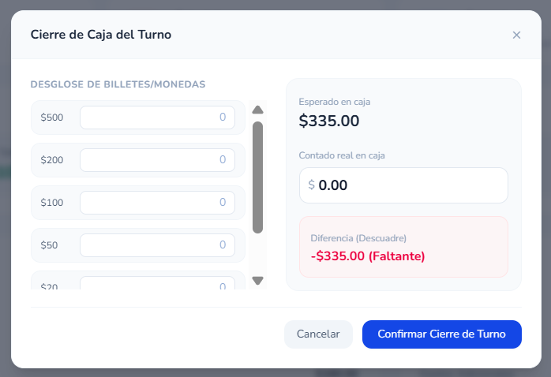

4. Al terminar de especificar da clic en el botón de Confirmar cierre de turno.  
5. Abrirá un mensaje de advertencia que indica si está seguro de realizar el corte, da clic en Si, Cerrar turno para terminar el proceso.

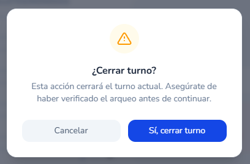

6. Al finalizar creará un reporte en formato PDF que puede descargarse, este mismo menciona un reporte de las ventas, gastos y retiros que se hayan hecho.

**CÓMO REALIZAR LA FACTURA GLOBAL**

1. Entra al apartado de Corte de Caja.  
2. Realiza el corte de caja como se indicó (Esto es importante realizar ya que el registro de la factura se guarda junto con el corte generado anteriormente).  
3. Al completar el proceso da clic en el botón de Generar Factura Global.  

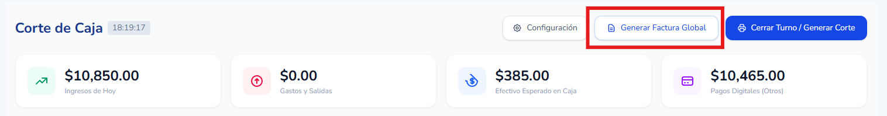

4. Abrirá una pequeña pantalla en donde debe indicarse la periocidad de la factura (en este caso sería Diaria).  

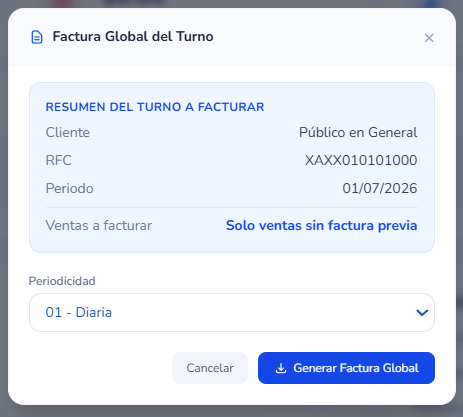

5. Da clic en Generar Factura Global para generarlo, al terminar de generarlo dará dos opciones, la primera permite visualizar el PDF que se genera y la segunda opción permite descargar el PDF junto con el archivo XML que se genera.

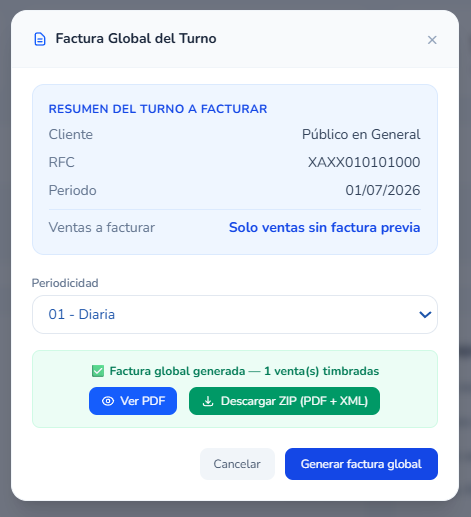

La factura debe de ser generada por el empleado que cierre el turno en horario nocturno, en caso de no realizarse en el sistema se mostrará que el corte de caja no realizó la factura del día.

**CÓMO CAMBIAR LOS DATOS DEL REPORTE DE CORTE DE CAJA**

1. Entra al apartado de Corte de Caja.  
2. Da clic en el botón de configuración.  

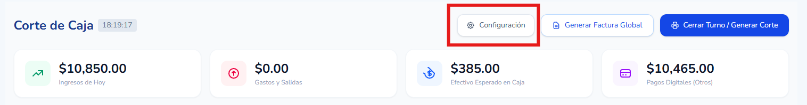

3. Abrirá un formulario en donde pueden editarse los siguientes campos:  
* Nombre del Negocio.  
* Dirección.  
* Ciudad.  
* Teléfono.  
* Código Postal.  

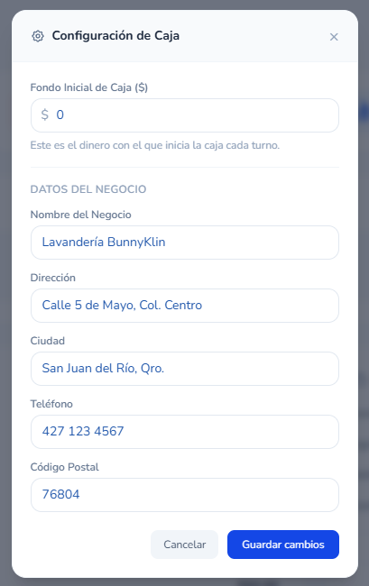

4. Al terminar de editar los campos da clic en Guardar cambios para terminar la edición.

Estos datos únicamente son para el reporte que se genera en el corte de caja, no son datos que se muestran en la factura.

**CÓMO CAMBIAR LA CANTIDAD INICIAL DE LA CAJA**

1. Entra al apartado de Corte de Caja.  
2. Da clic en el botón de configuración.  

3. Abrirá el formulario para cambiar los datos del reporte, pero el único campo que se modificará será el Fondo Inicial de Caja. 

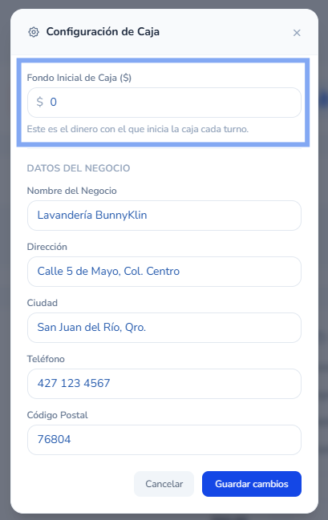

4. Al terminar de editar el campo da clic en Guardar cambios para terminar la edición.

Este valor solo afecta la cantidad con la que el empleado inicia la caja, debe ser usada en casos que se requiera.

**CÓMO REGISTRAR UN GASTO EN EL SISTEMA**

1. Entra al apartado de Corte de Caja.  
2. Ubícate en el apartado de Caja – Efectivo y da clic en Gasto Operativo.  

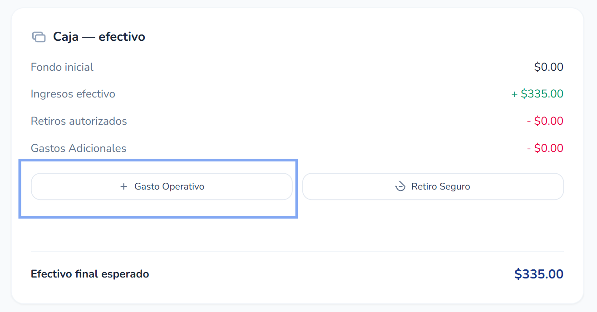

3. Abrirá un formulario donde deben completarse los siguientes campos:  
* Monto: Mencionar la cantidad del gasto.  
* Concepto o Descripción: Mencionar la razón o en qué se gastó el dinero.  

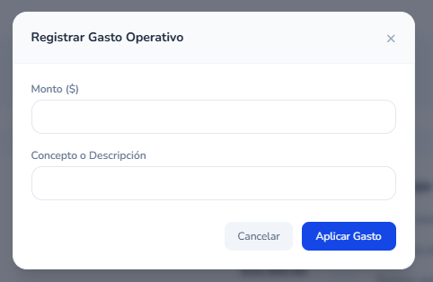

4. Al terminar de completar los campos da clic en Aplicar Gastos para que se guarden en el sistema.

Con esta opción se evita la falta de dinero en el corte de caja y no sea justificada.

**CÓMO REGISTRAR UN RETIRO DE DINERO EN EL SISTEMA**

1. Entra al apartado de Corte de Caja.  
2. Ubícate en el apartado de Caja – Efectivo y da clic en Retiro Seguro.  

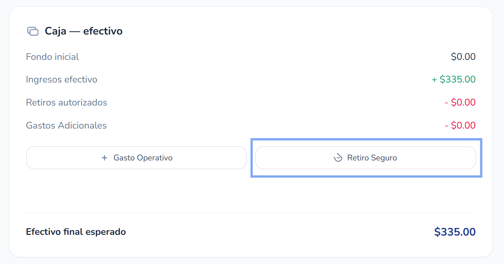

3. Abrirá un formulario que debe completarse con los siguientes campos:  
* Monto a retirar: Mencionar la cantidad que se retira.  
* Quién recibe: Mencionar el nombre de la persona que recibe el dinero.  

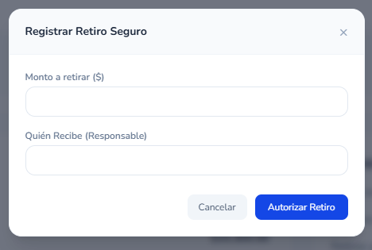

4. Al completar el formulario da clic en Autorizar Retiro para registrarlo en el sistema.

Con esto se evita que el dinero desaparezca sin motivo aparente y pueda justificarse.

**CÓMO GENERAR UNA FACTURA**

1. Entra al apartado de Facturación.  
2. Dentro del apartado se mostrará un formulario que debe de completarse con los siguientes campos:  
* Cliente Registrado: Con este campo el sistema busca un cliente que se encuentre registrado en el sistema, al seleccionar autocompleta algunos campos que el cliente ya ha registrado anteriormente.  
* Nombre Legal / Razón Social: Nombre del cliente.  
* RFC.  
* Régimen Fiscal: Selecciona el régimen fiscal acordé al cliente.  
* Uso de CDFI: Selecciona la forma en la que el cliente quiere facturar la venta.  
* Método de Pago: Selecciona el método de pago con el que se realizó la venta.  
* Forma de Pago: Selecciona la forma de pago con la que se realizó la venta.  
* Email.  
* Código Postal.  

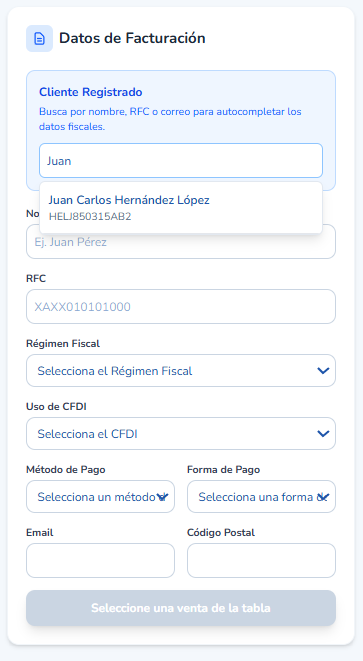

3. Al terminar de llenar los campos selecciona una venta para poder activar el botón de Generar Factura.  

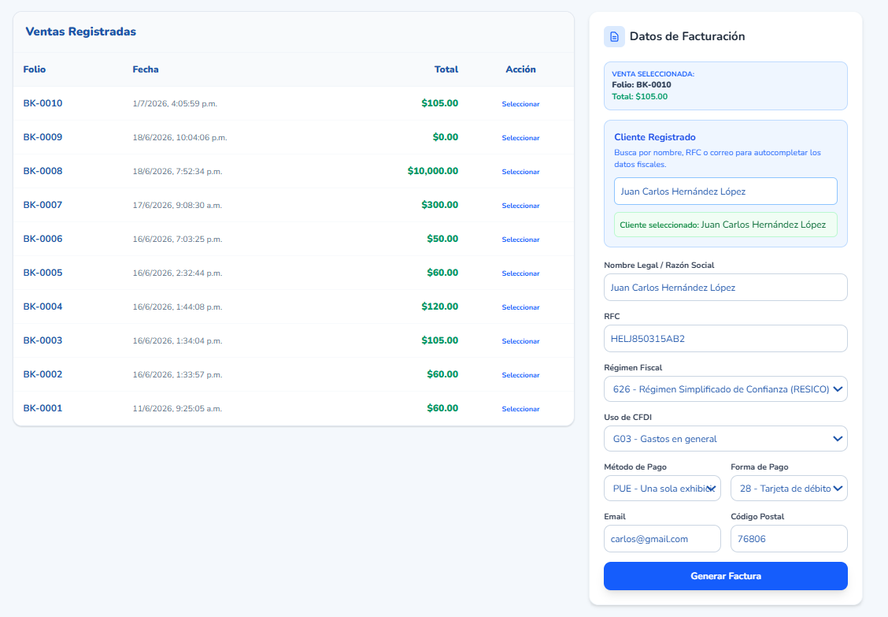

4. Da clic en el botón y el sistema generará un mensaje en la parte superior donde permite visualizar el PDF generado de la factura o descargar el archivo XML generado junto con el archivo PDF.

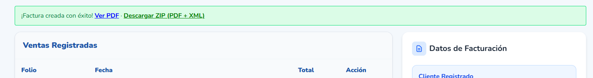

Este apartado únicamente tiene la función de generar la factura hacia el cliente, está venta ya no se factura al hacer la factura global.

**POSIBLES PROBLEMAS**

**ERROR AL FACTURAR**

Al momento de facturar pueden ocurrir errores o problemas, aquí mencionamos alguno de ellos.

1. **RFC INVALIDO**

Se registra un RFC inválido al momento de facturar, enviando un error al momento de generar la factura.

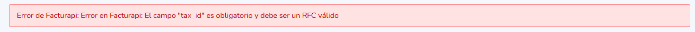

La solución a este problema es verificar que el RFC sea correcto, sea de una persona moral o una persona física debe corroborarse en caso de errores.

2. **CLAVE SAT INCORRECTA**

El sistema registra la clave del producto o servicio del SAT, esto es necesario ya que facilita el proceso de facturación, pero al ingresar una clave incorrecta el sistema lo identifica como un error.

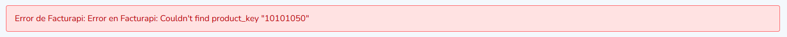

La solución es revisar la clave del producto o servicio y verificar que sea la correcta o esté bien escrita, después de ello puede intentarse de nuevo.

3. **PROBLEMA CON LAS LLAVES DE FACTURAPI**

El sistema obtiene una llave para vincular los servicios de Facturapi con el Punto de Venta, estos mismos tienen un tiempo límite, pueden existir dos casos usuales.

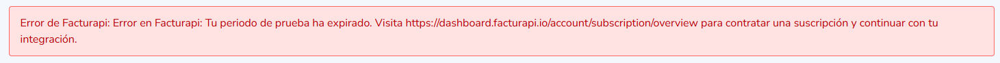

* Periodo Expirado: Puede ser causado porque el plan de prueba haya expirado o no se haya realizado el pago.   
    
  La solución es realizar el pago correspondiente.  
    
* Llave vencida: Las llaves de Facturapi tienen un tiempo de vencimiento, por lo cual deben ser actualizadas cuando ocurra el problema.  
    
  La solución será actualizar la llave de acceso dentro de Facturapi, reemplazarla dentro del código para que funcione de nuevo.

4. **CAMPOS NO SELECCIONADOS**

Para generar una factura es necesario completar todos los campos del formulario, en la falta de alguno de ellos puede provocar que el mensaje que la página refleje sea por ejemplo como el siguiente.

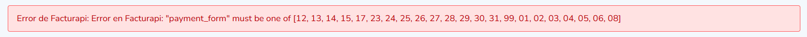

Este error se produce a causa de no seleccionar el método de pago con la que se realizó la venta, la corrección para este tipo de problemas es completar los campos de manera correcta y verificar que todos esten rellenados.

