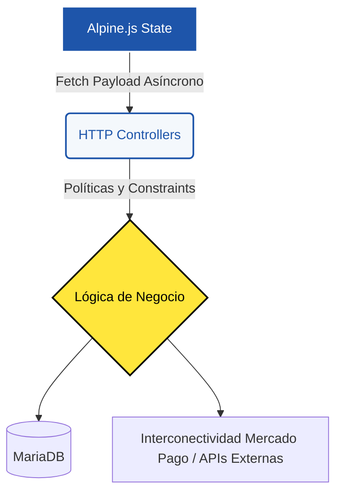

# Arquitectura de Módulos - BunnyKlin POS

Este directorio alberga la documentación exhaustiva del código fuente,
organizada por módulos operativos. Cada documento desglosa la interconectividad
entre el frontend reactivo (vistas Blade con Alpine.js), la lógica de negocio
(Servicios) y las pasarelas que controlan el Punto de Venta de la lavandería
BunnyKlin.

La arquitectura de la aplicación se rige por tres principios inquebrantables de
desarrollo:

1. **Transaccionalidad SQL Segura:** Modificaciones transversales a base de
   datos se encapsulan en Bloques `DB::transaction()` manejados en la Capa de
   Servicios, evadiendo cobros fraudulentos o inventarios rotos.
2. **Componentización de UI en RAM:** El uso profundo de Eager Loading para
   inyectar modelos enteros del lado del cliente y administrar el estado en
   Javascript (`AlpineJS`) anulando latencias visuales.
3. **Auditoría Inmutable:** Creación de _Snapshots_ temporales al registrar
   precios de venta al vuelo y uso agresivo de Polling o WebHooks para asegurar
   conciliaciones contra APIs externas (Mercado Pago).

---

## Índice de Módulos Lógicos

El sistema se consolida en cinco módulos fundamentales. Haz clic en cualquiera
de los enlaces a continuación para sumergirte en el código y flujos de trabajo
detallados de cada área operativa:

### 1. [Punto de Venta (POS)](pos.md)

El componente omnicanal más denso del software y el corazón monetario.

- Analiza la integración del Carrito Volátil (Javascript Frontend).
- Documentación del mecanismo de Sondeo en vivo (Aggressive Polling) de
  Terminales **Point Smart**.
- Implementación paralela de cobros en línea (Payment Bricks y Web Preferences)
  con Mercado Pago e inyecciones "Transparentes".

### 2. [Historial de Ventas](historial.md)

El módulo perimetral de auditoría y facturación local orientada a Cajeros.

- Paginación masiva pre-cargada y Eager Loading optimizado en Queries.
- Configuraciones persistentes locales (LocalStorage) del generador de _Tickets_
  térmicos mediante macros CSS `@media print`.
- Políticas restrictivas de destrucción segura de transacciones masivas
  vinculadas en cascada a MySQL.

### 3. [Pedidos y Encargos de Taller](pedidos.md)

Motor asíncrono para gestionar operaciones de servicio diferido (e.g. ropa a
lavar en el futuro).

- Flujos secuenciales para orquestar la inserción de Renglones, Cabeceras
  Financieras y Cabeceras Operativas (Status) al mismo tiempo.
- Procesamiento transversal: Mecanismos para la sustracción en vivo de kilos de
  las Suscripciones y deducciones financieras frente a adelantos monetarios de
  los Clientes en ventanilla.

### 4. [Clientela y CRM](clientes.md)

El administrador del directorio de usuarios de la lavandería que da soporte e
inyecta UUIDs a las ventas generales.

- Manejo simultáneo e intercepto de datos fiscales para Facturación Electrónica
  en México.
- Estructura atómica al tramitar cancelaciones, renovaciones o transiciones
  mensuales matemáticas de un plan tarifario por kilos para preservar contadores
  a tope limitados de cada ciclo de un cliente.

### 5. [Catálogo e Inventario Dinámico](catalogo.md)

Orquestador base de todo producto vendible o utilizable por los cajeros dentro
de la app (Insumos, Servicios, Membresías).

- Metadatos polimórficos atados a la directiva Eloquent para ser insertados
  uniformemente como renglones contables.
- Re-escritura en caché reactivo y manejo binario frente a desabastos
  restrictivos (`stock <= 0`).
- Manejo de Soft Deletions (Flags de visibilidad) para proteger relaciones y no
  dañar ventas históricas pre-existentes en contabilidad.

---

## Diagrama Funcional Simplificado de Backend Limitado (MVC)

Aunque la UI de AlpineJS vive del lado del cliente, todas las directrices
convergen hacia controladores de Laravel que derivan la carga final destructiva
a Capas de Servicio independientes.

