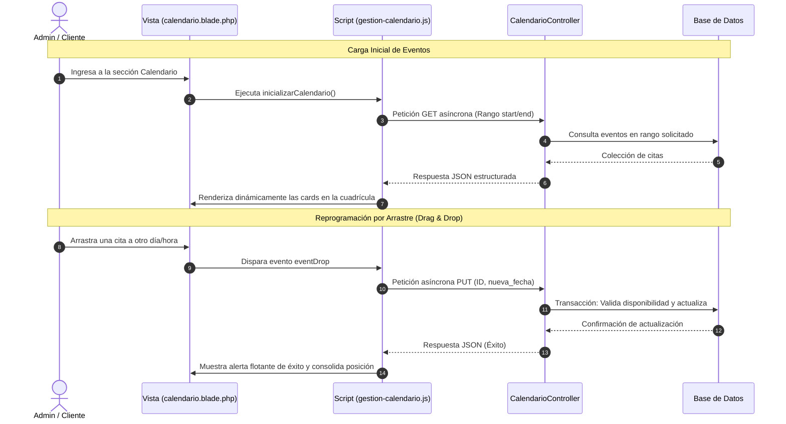

# Módulo: Calendario de Citas y Eventos



### 1. Descripción General
El módulo de Calendario gestiona la agenda del local. Permite la visualización, creación y reprogramación interactiva de citas, reservaciones de maquinaria o asignación de turnos. Centraliza el control de tiempos para evitar sobrecupos y está diseñado para sincronizarse dinámicamente con los estados operativos del negocio.

* **Estado del Módulo:** **En Producción **

---

### 2. Modelo de Datos y Persistencia
La persistencia de las fechas y la disponibilidad se administra mediante Eloquent ORM con las siguientes directrices:

* **Tablas / Migraciones afectadas:** `eventos`, `citas` y `horarios_bloqueados`.
* **Relaciones del Modelo (`Evento.php` o `Cita.php`):**
  * `cliente()`: Relación `belongsTo` vinculada a `Cliente::class` o `User::class` para identificar al titular de la reserva.
  * `maquina()` / `servicio()`: Relación opcional `belongsTo` que asocia el evento a un recurso específico del local para controlar la disponibilidad física de los dispositivos.

---

### 3. Arquitectura del Backend (Controladores y Rutas)
* **Controlador Principal:** `CalendarioController.php`
* **Métodos y Lógica de Negocio:**
  * `index()`: Carga la vista base del calendario e inyecta las configuraciones de jornadas laborales y días festivos.
  * `obtenerEventos()`: Endpoint tipo API (GET) que devuelve un arreglo JSON con las citas filtradas por un rango de fechas (`start` y `end`), optimizado para las peticiones automáticas del frontend.
  * `guardarEvento()` / `actualizarEvento()`: Procesa las peticiones POST/PUT. Valida que el horario no esté ocupado previamente (prevención de colisiones) y persiste o modifica el bloque de tiempo en la base de datos.

---

### 4. Interfaz de Usuario (Frontend - Blade)
* **Vista Principal:** `calendario.blade.php`
* **Descripción de la Interfaz:** Renderiza un contenedor principal adaptado para librerías de componentes visuales (como FullCalendar). Cuenta con vistas intercambiables por mes, semana y día, indicadores de estado por colores (ej. *Pendiente, Confirmado, Cancelado*) y ventanas modales interactivas que se disparan al hacer clic sobre un día vacío o sobre una cita ya agendada.

---

### 5. Lógica del Cliente (JavaScript / AJAX)
* **Script Asociado:** `gestion-calendario.js`
* **Ciclo de Vida y Evitación de Caché:** Invocado mediante `?v={{ time() }}` para garantizar que cualquier cambio en las reglas de renderizado o mapeo JS se aplique de inmediato sin interferencias de la caché del navegador.
* **Funciones Clave:**
  * `inicializarCalendario()`: Configura el objeto global del calendario, monta los listeners de eventos y define la carga asíncrona de citas mediante Fetch/AJAX.
  * `manejarDrop_Resize()`: Evento que se ejecuta cuando el usuario arrastra (`drag and drop`) o estira una cita en pantalla; calcula las nuevas horas de inicio/fin y envía una actualización silenciosa al servidor en segundo plano.
  * `abrirModalFormulario()`: Extrae los datos del día seleccionado, limpia los campos residuales del formulario e inicializa el flujo de validación visual antes de enviar una nueva cita.

---

### 6. Integraciones o Dependencias Externas
* **FullCalendar API / Moment.js:** Utiliza la librería FullCalendar para el manejo del DOM y la cuadrícula interactiva, complementado con Moment.js o la API nativa de JavaScript para el formateo estandarizado de zonas horarias e hilos de fechas ISO 8601.

---

# 7. Rutas de acceso

Para el apartado del Calendario únicamente requerimos la ruta de acceso al apartado para ser funcional:

```php
Route::get('/newcalendar', [CalendarController::class, 'index'])->name('calendar.index');
```