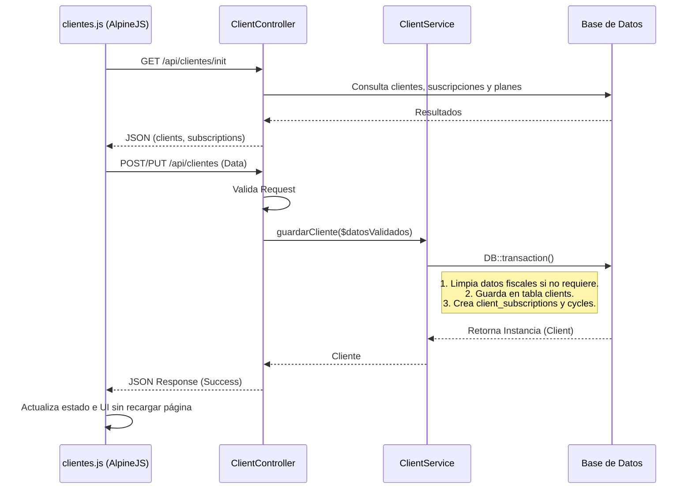

# Módulo: Clientes y Suscripciones

Este modulo gestiona la información de los clientes, maneja las direcciones
operativas y fiscales, administra las suscripciones (contratos mensuales) y
mantiene un registro actualizado del ciclo vital de la facturación en la
lavandería.

## 1. Arquitectura de Flujo (Diagrama de Secuencia)

Diagrama para mostrar cómo viaja la información al consultar, registrar o editar
un cliente, vinculando el frontend, controlador, servicio y base de datos.

## 2. Frontend (Vista y JavaScript)

**Archivos involucrados:** `clientes.blade.php`, `clientes.js`

### Responsabilidad

Manejar el registro, la edición y la visualización de los clientes. Utiliza
**Alpine.js** (`clientManager`) para que la gestión de modales, el filtrado de
clientes en la tabla y el cálculo de caducidad en las suscripciones fluyan en
memoria en tiempo real, mejorando sustancialmente la experiencia del usuario
(sin recargar la página).

### Funciones principales en JavaScript

#### `cargarDatosDesdeBD()`

Se ejecuta al inicio (vía método `init()`). Hace una solicitud a
`/api/clientes/init` para obtener todos los clientes y los tipos de planes
actuales, guardándolos localmente para renderizar la tabla base de forma
dinámica.

#### `openModal(mode, client)`

Dependiendo si es modo "añadir", "ver" o "editar", habilita o inhabilita campos
del modal. Inicializa un estado reactivo asociando los datos o reiniciandolos a
valores vacíos predeterminados, para preparar la edición o creación del usuario.

#### `saveClient()`

Acondiciona y sanitiza los datos del cliente antes de enviarlos, (por ejemplo,
mandando fechas o subscripciones seleccionadas a nulo si provienen sin asignar).
Realiza el envío HTTP por `POST` o `PUT` usando las API y actualiza la lista
local de `this.clients` evitando hacer un fetch total de regreso desde DB.

#### `getSubscriptionStatus(client)` y `actualizarFechaVencimiento()`

Ambas funciones validan la vigencia temporal de los planes de cada cliente
usando los offsets del servidor y el cliente. Emiten clases CSS reactivas y
etiquetas descriptivas ("CADUCADA", "ACTIVA (Vence hoy)") dependiendo de si las
fechas se encuentran menores al día en curso.

### Manejo de estado e interfaz (UI)

La vista consta de una tabla general enteramente vinculada por directivas de
iteración reactiva a un buscador de texto (vinculado con
`x-model="searchQuery"`). Cuando un cliente marca la casilla `wantsBilling`,
Alpine despliega un bloque de captura del régimen fiscal y CFDI con
`x-collapse`. Las eliminaciones o edicioones redibujan instantáneamente el
renglón.

---

## 3. Controlador (Enrutamiento y Validación)

**Archivo:** `ClientController.php`

### Responsabilidad

Es la cara de la red HTTP actuando como punto de entrada de la API para clientes
(`/api/clientes`). Efectúa validaciones muy estrictas mediante funciones
`validate()` de todas las reglas del Request y delega todo contacto de bases de
datos al nivel subyacente.

### Endpoints clave

#### `GET /api/clientes/init`

Respuesta optimizada que extrae de manera consolidada, el padrón general de
clientes, el subárbol de dependencias pre-cargado (`currentSubscription.plan`,
`currentSubscription.currentCycle`) y todos los planes activos en tan solo unas
cuantas querys de base de datos.

#### `POST /api/clientes` y `PUT /api/clientes/{client}`

Reciben el payload para insertarse / actualizarse en el sistema. Asegurandose
que cada campo como direcciones fisicas (si `same_billing_address` no esta
chequeado), rfc y nombre esten provistos y en forma. Ejecuta el
`$this->clientService->guardarCliente()`.

#### `GET /clientes/buscar`

Implementa un endpoint general empleado globalmente en búsquedas de barra o
cajas (POS) al retornar el extracto reducido de hasta decenas de perfiles en
modo "búsqueda por nombre, rfc o email" acotado a 10 resultados para
autocompleción en vivo.

### Lógica implementada

- El controlador inyecta la clase `ClientService` mediante su constructor
  evitando recargar el cuerpo con lógica transaccional ajena.
- Maneja un robusto esquema de validación para las direcciones "Operativas"
  frente a las "Fiscales".

---

## 4. Capa de Servicio (Lógica de Negocio)

**Archivo:** `ClientService.php`

### Responsabilidad

Se encarga de aislar todo el enjambre de escrituras críticas sobre varias tablas
dentro de una sola barrera atómica. Procesa las decisiones según los check-box
del frontend (como si desean igualar domilios y facturar) y levanta la apertura,
finalización y subrutina de ciclos en los contratos.

### Métodos clave

#### `guardarCliente(array $datos, ?Client $client = null): Client`

Encierra el bloque pesado de negocio con `DB::transaction()` siguiendo estos
pasos:

1. **Lógica de Facturación:** Evalúa `$datos['wantsBilling']`. Si esto no viene
   chequeado (falso), el sistema blanquea y depura todas las entradas fiscales
   para mantener la integridad en DB. En contraparte, si decide emular la misma
   matriz al fiscal (`same_billing_address`), copia las columnas
   `codigo_postal`, `calle`, etc... a las cajas `fiscal_**` de destino.
2. **Exclusión paramétrica de Suscripción:** Extirpa intencionalmente los datos
   `subscription_id` y `start_subscription` del arreglo de origen, puesto que no
   forman parte del esquema del cliente si no de su historial.
3. **Persistencia de Cliente:** Se crea o sobrescribe el recurso general con
   `$client->update($datos)` o `Client::create($datos)`.
4. **Arquitectura de Suscripciones:**
   - Determina a partir del tiempo de la suscripción, los saltos (ej: si son de
     6 meses le adjunta un mes con `addMonthsNoOverflow()`).
   - Cancela contratos antiguos.
   - Adjunta el nuevo periodo en `client_subscriptions`.
   - Genera explícitamente el anidado para el **Ciclo Inicial** en base al
     `kilos_per_month` otorgado instanciandose en 0 el uso y consumo actual
     (`kilos_consumed = 0`) para dar comienzo al servicio de abonos.

#### `eliminarCliente(Client $client): bool`

Elimina al cliente del registro, confiando en migraciónes de integridad del lado
SQL (OnDelete Cascades o Set Nulls) para no romper el historial de reportes de
las cajas si están adjuntas.

### Manejo de excepciones

Gracias al cerco con `DB::transaction()`, si los mapeos del ciclo de suscripción
fallan por incongruencias o el ingreso del cliente fracasa, todo interloque
(Suscripción + Tablas Cliente + Ciclos) revierte (Rollback) por diseño
devolviendo fallas impecables al Controlador.
