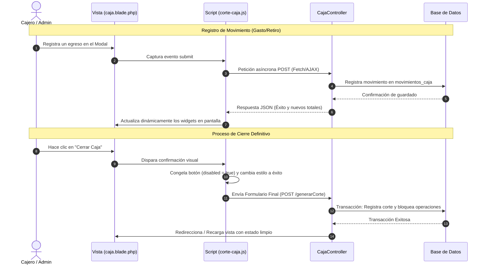

# Módulo: Corte de Caja



### 1. Descripción General
El módulo de Corte de Caja proporciona la infraestructura de control financiero diaria del local. Centraliza el monitoreo de flujos monetarios divididos por métodos de pago (efectivo en caja, retiros, gastos y vouchers), permitiendo a los cajeros y administradores realizar cierres parciales o definitivos del turno, bloquear operaciones duplicadas y disparar de manera asíncrona subprocesos críticos como la facturación masiva.

* **Estado del Módulo:** **En Producción**

---

### 2. Modelo de Datos y Persistencia
El módulo interactúa directamente con el ORM Eloquent a través de relaciones sólidas para auditar cada transacción:

* **Tablas / Migraciones afectadas:** `cortes_caja`, `configuracion_caja` y `movimientos_caja`.
* **Relaciones del Modelo (`CorteCaja.php`):**
  * `user()`: Relación de pertenencia (`belongsTo`) que mapea la transacción al usuario autenticado (`User::class`) que efectúa el cierre.
  * `movimientos()`: Relación de uno a muchos (`hasMany`) vinculada a `MovimientoCaja::class`, permitiendo el desglose granular de entradas y salidas de efectivo asociadas a ese corte específico.

---

### 3. Arquitectura del Backend (Controladores y Rutas)
* **Controlador Principal:** `CajaController.php`
* **Métodos y Lógica de Negocio:**
  * `corte()`: Renderiza la interfaz inicial, calcula los balances activos de los métodos de pago en tiempo real y transfiere las variables globales de estado a la vista.
  * `generarCorte()`: Procesa la petición POST del cierre de caja, ejecuta reglas de validación transaccionales, bloquea los registros para evitar inconsistencias contables y persiste los datos del cierre definitivo.
  * `facturaGlobal()`: Handler asíncrono encargado de empaquetar de forma masiva los tickets del día y derivarlos al servicio externo de facturación.

---

### 4. Interfaz de Usuario (Frontend - Blade)
* **Vista Principal:** `caja.blade.php`
* **Descripción de la Interfaz:** Presenta un panel de control con indicadores o *widgets* numéricos superiores que desglosan de manera síncrona el efectivo actual en caja, gastos consolidados y retiros autorizados. Dispone de ventanas modales embebidas encargadas de aislar los formularios críticos para el registro de movimientos manuales y la confirmación visual de cierres de caja definitivos.

---

### 5. Lógica del Cliente (JavaScript / AJAX)
* **Script Asociado:** `corte-caja.js`
* **Ciclo de Vida y Evitación de Caché:** El script se invoca forzando la renovación del ciclo de vida en el navegador mediante el helper `?v={{ time() }}` en la directiva Blade, impidiendo que datos financieros antiguos se almacenen en la memoria caché del cliente.
* **Funciones Clave:**
  * `agregarGastoLocal()` / `agregarRetiroLocal()`: Interceptan los flujos de captura locales, disparan peticiones asíncronas vía AJAX/Fetch hacia el servidor y refrescan dinámicamente las métricas numéricas sin alterar el estado general de la página.
  * `confirmarCierreCaja()`: Gestiona la validación del modal de confirmación, congela el botón principal (`disabled = true`) e inyecta una transformación de éxito visual ("✨ ¡Cierre Realizado con Éxito!") para otorgar retroalimentación clara antes de liberar el envío del formulario al backend.

---

### 6. Integraciones o Dependencias Externas
* **Facturapi / DomPDF:** El módulo intercepta los cortes confirmados para delegar la construcción de comprobantes globales utilizando la API externa de Facturapi y renderiza las bitácoras o reportes de arqueos contables en formato PDF mediante el procesador DomPDF.


---

# 7. Rutas de acceso

Para este apartado se especifican distintas distintas rutas que permiten ejecutar funciones necesarias:

```php
Route::get('/caja', [CajaController::class, 'corte'])->name('caja');
Route::post('/caja/movimiento', [CajaController::class, 'movimiento'])->name('caja.movimiento');
Route::post('/caja/generar-corte', [CajaController::class, 'generarCorte'])->name('caja.generarCorte');
Route::post('/caja/factura-global', [CajaController::class, 'facturaGlobal'])->name('caja.facturaGlobal');
Route::put('/caja/configuracion/fondo', [CajaController::class, 'actualizarFondo'])->name('caja.actualizarFondo');
```