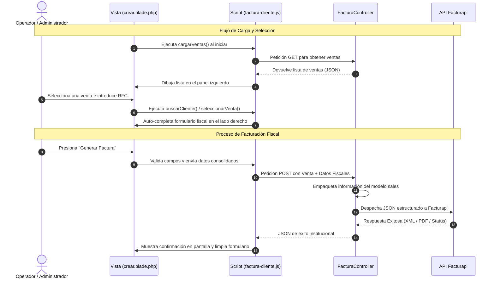

# Módulo: Facturación de Clientes



### 1. Descripción General
El módulo de Facturación proporciona una herramienta automatizada para generar comprobantes fiscales a petición de cualquier cliente. El sistema recopila y valida los datos fiscales obligatorios en el local y los delega de manera segura al servicio externo de Facturapi para procesar la timbración oficial, facilitando además la consulta de clientes existentes e historiales de ventas de forma inmediata.

* **Estado del Módulo:** **En Producción**

---

### 2. Modelo de Datos y Persistencia
El módulo interactúa principalmente con los registros de transacciones y clientes del sistema:

* **Tablas / Modelos afectados:** `sales` (Ventas), `clientes` (o datos fiscales guardados).
* **Flujo de Persistencia:** La información de las ventas se recupera del modelo de ventas para empaquetarse en conjunto con los nuevos datos fiscales ingresados o seleccionados del cliente, preparándolos para la estructura JSON requerida por el nodo de integración.

---

### 3. Arquitectura del Backend (Controladores y Rutas)
* **Controlador Principal:** `FacturaController.php`
* **Métodos y Lógica de Negocio:**
  * `index()` / `create()`: Prepara el entorno para la creación de la factura, llamando al historial de ventas elegibles.
  * **Manejo de Peticiones HTTP:** Se encarga de capturar el payload enviado por el cliente, procesar las relaciones del modelo de ventas (`sales`) y estructurar los parámetros fiscales que se despacharán al API Provider.

---

### 4. Interfaz de Usuario (Frontend - Blade)
* **Vista Principal:** `crear.blade.php`
* **Descripción de la Interfaz:** Presenta una pantalla dividida estratégicamente en dos secciones para optimizar la experiencia de usuario:
  * **Lado Izquierdo:** Muestra un panel interactivo con el historial de las ventas realizadas en el sistema para su selección directa.
  * **Lado Derecho:** Un formulario dinámico de datos fiscales que permite capturar información nueva o activar la barra de búsqueda integrada para localizar datos ya existentes.

---

### 5. Lógica del Cliente (JavaScript / AJAX)
* **Script Asociado:** `factura-cliente.js`
* **Ciclo de Vida:** Controlado con renovación dinámica para evitar el almacenamiento en caché de peticiones previas.
* **Funciones Clave:**
  * `cargarVentas()`: Realiza la lectura asíncrona de las ventas registradas en el local y las renderiza ordenadamente en la lista de selección.
  * `seleccionarVenta()`: Captura la venta elegida por el operador, bloquea su identificador y adapta su estructura para enlazarla directamente al proceso de facturación.
  * `buscarCliente()`: Consulta en tiempo real dentro del sistema para comprobar si el RFC o nombre escrito en la barra de búsqueda ya cuenta con un perfil fiscal.
  * `seleccionarVenta()` *(Relleno)*: Auto-completa instantáneamente todos los campos del formulario fiscal utilizando los datos recuperados del cliente seleccionado para mitigar errores humanos de captura.

---

### 6. Integraciones o Dependencias Externas
* **Facturapi API:** Funciona como el proveedor externo principal (WebService). Recibe los paquetes de datos estructurados por el backend, procesa la timbración fiscal ante las entidades correspondientes y devuelve el estatus de emisión junto con los archivos listos para el cliente.

---

# 7. Rutas de acceso

Para el apartado de Facturación requerimos de diferentes rutas para crear una factura u obtener los archivos de Facturapi:

```php
Route::get('/facturacion', function () { return view('pages.facturacion', ['title' => 'Facturación SAT']); })->name('facturacion');
Route::get('/factura/crear', [FacturaController::class, 'create'])->name('factura.crear');
Route::post('/factura/crear', [FacturaController::class, 'facturar'])->name('venta.facturar');
Route::get('/factura/archivo/{id}/{tipo?}', [FacturaController::class, 'descargarArchivo'])->name('factura.archivo');
```