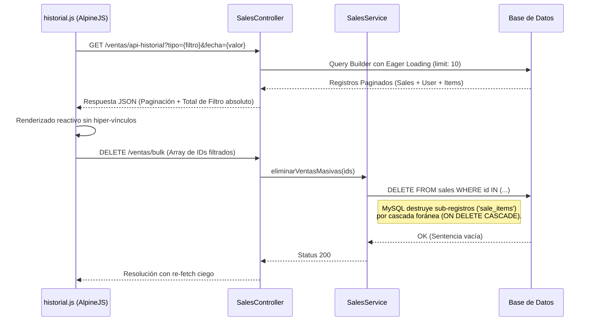

# Módulo: Historial de Ventas

Este módulo administra la exploración retrospectiva, el filtrado dinámico y la
auditoría (o destrucción) de ingresos reportados. Adjudica un controlador visual
flexible que gestiona la personalización local de tickets para impresión térmica
(POS printers) ignorando almacenamiento en base de datos de parámetros banales
(como el logo o el saludo).

## 1. Arquitectura de Flujo (Diagrama de Secuencia)

## 2. Frontend (Vista y JavaScript)

**Archivos involucrados:** `historial.blade.php`, `historial.js`

### Responsabilidad de Estado

Gestión total en navegador usando la directiva reactiva `historialSystem`.
Sincroniza paginadores inyectados desde Laravel frente al buscador por flatpickr
limitando colapsos de memoria en el cliente. Intercepta perimetralmente la
salida del DOM durante impresiones con macros `@media print` exclusivas.

### Componentes JS Críticos

#### Orquestación Asíncrona (Método `cargarDatos`)

Envuelve constructores temporales para reestructurar variables nativas del
framework. Al invocar la petición HTTP, actualiza los apuntadores del paginador
nativo de la UI de Laravel a un esqueleto local e incrusta el `totalFiltro`,
protegiendo la matemática de suma absoluta que ya fue resuelta eficientemente en
Backend.

#### Almacén Reactivo `Alpine.store('ticketConfig')`

Esquiva a la BD para la configuración visual del frontend hacia la impresora.
Graba de forma local y duradera (_LocalStorage_ del navegador) cabeceras,
logotipos serializados como `bases64` de imagen pre-codificada y footers. Este
módulo muta la interfaz de lectura a un layout puramente editable sin refetches.

#### Macros `@media print` y renderizado

Dispara invocaciones hardcodeadas hacia `window.print()` tras 150ms. Se apoya
estrictamente de exclusiones de regla CSS, silenciando visibilidad de navegación
e invocando márgenes matemáticos brutos (`58mm`), re-aislando cada iteración del
JSON al visor del ticket.

---

## 3. Controlador

**Archivo:** `SalesController.php`

### Mapeos Absolutos e Inicialización Analítica (`apiHistorial`)

Opera peticiones de filtrado paramétrico de Query Builder. Extrae con una
transacción paralela simple la cantidad bruta contable del filtro sin límite de
paginador (`sum('total')`).

Evadiendo colisiones en objetos anidados reactivos del frontend, el controlador
castea agresivamente las colecciones JSON a arreglos brutos inyectándole
transversalmente llaves forzadas (`nombre_vendedor`), asegurando simplicidad
iterativa máxima antes de regresar el Body.

### Eliminaciones (`destroyBulk`)

Valida de forma restrictiva array injections forzando `integer|exists:sales,id`
previo a detonar cadenas borradas; una salvaguarda básica y robusta contra
corrupciones manuales.

---

## 4. Capa de Servicio (Lógica de Negocio)

**Archivo:** `SalesService.php`

### Responsabilidad Directa

Garantiza el paralelismo mutante hacia diferentes ecosistemas de base de datos
(`Service`, `Supply`, `Subscription`) en una única rutina y mantiene un cerco
seguro a través de los contadores fisicos del almacén de utilería.

### Mutaciones Polimorfas (`procesarVenta`)

Encierra un flujo multi-tabla:

1. Instancia del recibo cabecera a través del creador de `Auth::id()`.
2. Extracción condicional a partir de arrays pre-cargados que asocian llaves
   literales hacia rutas de namespaces polimórficos como
   `\App\Models\Service::class`.
3. Inserción de "snapshots" estáticos del precio global al ciclo transaccional
   previniendo asimetrías de auditorías en el futuro.
4. **Control Inyectado de Desabasto**: Valida exclusivamente por la rama local
   de si el origen provino de `supplies` interrogando a DB directamente contra
   las barreras del stock. Ante la ausencia (`stock < quantity`), escupe
   excepciones retro-propagadas obligando la inhibición del commit a
   transacciones y evadiendo ingresos engañosos. Realiza a su vez, una directiva
   seca de base de batos `decrement('stock')` con latencias mínimas.

### Limpiezas Estructurales (`eliminarVenta`)

Suprime y externaliza la delegabilidad. Elimina al recurso padre `Sale` dejando
enteramente encomendada la extirpación de `sale_items` a las migraciones (ON
DELETE CASCADE) de nivel base de datos sobre la llave foránea del esquema.
