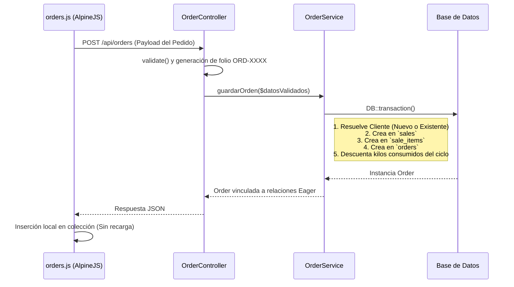

# Módulo: Pedidos y Encargos

Este módulo administra los servicios prolongados (pedidos por kilos o piezas) a través del tiempo. Enlaza directamente la logística operativa (estados del pedido, fechas de entrega) con el componente transaccional financiero (ventas, importes adelantados). También gestiona las compensaciones automáticas y deducciones de kilos para clientes bajo suscripciones mensuales.

## 1. Arquitectura de Flujo (Diagrama de Secuencia)

El ciclo de inserción procesa en cascada un "encargo", su "venta" subyacente y la deducción de cuotas para garantizar consistencia, apoyado en transacciones SQL.

## 2. Frontend (Vista y JavaScript)

**Archivos involucrados:** `pedidos.blade.php`, `orders.js`

### Responsabilidad y Estado

La interfaz maneja la creación y actualización asincrónica a través de AlpineJS (`ordersManager`). Estructuras de datos base (listado de órdenes, clientes disponibles y catálogo de servicios aplicables a pedidos) se extraen proactivamente a la memoria local durante la instancia de inicialización de la página y se limitan a re-escribirse sobre RAM sin obligar una descarga completa por cada edición de un usuario.

### Lógicas Principales en JavaScript

#### Cálculo Dinámico de Total (`calcularTotalAutomatico`)
Disparado en caliente por cambios en el `select` de servicio o el input numérico. Se divide en dos vertientes:
- **Flujo Directo**: `total = kilos * precio_base`.
- **Deducción de Suscripción**: Si un cliente se ligó al encargo y cuenta con kilos residuales activos (`selectedClientKilos`), asume el encargo descontando el diferencial sin penalizar el importe base a cobrar del excedente (E.g. Cobrar solo por 2kg de demasía en un pedido de 10kg bajo suscripciones de 8kg de cobertura).

#### Control Selectivo de Cliente (`selectClient` / `clearClientSelection`)
Alterna entre un cuadro de texto libre y un motor simple de filtrado por iteración de arrays para localizar clientes del catálogo que alimenta el dropdown. El acople sobreescribe las variables vinculadas a `client_id`, activa los badges de planes y dispara en cascada revisiones matemáticas de reajustes en el total estimado.

#### Constreñimiento de Interfaz
Mecanismos como `x-show` sobre variables de estado inhabilitan (`disabled: modalMode`) modificaciones sobre clientes ajenos cuando el modo del modal cae en contexto de sólo-lectura o edición en progreso, bloqueando asincronismos incongruentes que pudieran llegar al backend.

---

## 3. Controlador

**Archivo:** `OrderController.php`

### Responsabilidad
Aplicar verificaciones estructurales al objeto Request e inyectarle los identificadores autoincrementales operativos de negocio operables previo a entregar flujo de ejecución.

### Endpoints y Métodos Críticos

- **`apiInit()`**: Eager Loading unificado con encadenamiento de dependencias (carga clientes, servicios y el estado financiero en bloque `[client, sale, service]`) aliviando problemas N+1 hacia SQL al proveer toda la matriz a `orders.js`.
- **`store()`**: Captura e inhibe inyecciones SQL o escalado a desbordes de `quantity` y `advance`. Inspecciona el último ID persistido y construye un folio referencial acolchado con ceros (`ORD-0000X`), resolviendo sobre la variable validada antes de enviarla al bloque de creación pesado.

---

## 4. Capa de Servicio (Lógica de Negocio)

**Archivo:** `OrderService.php`

### Responsabilidad
Orquestar en paralelo hasta cinco bloques de sentencias DML mediante un Wrapper Transaccional de DB. Revierte todo cobro o asignación fraudulenta ante un error en cascada.

### `guardarOrden`
Método hiper-condensado de acciones. La rama de **Creación** ejecuta cinco fases obligatorias:
1. **Resolución Expresa de Cliente (`firstOrCreate`)**: Localiza el nombre exacto por comparativa de string (si no hay ID ligada) e inserta a DB, retornando identificador subyacente para no romper llaves foráneas.
2. **Generación Financiera (`Sale`)**: Forja la cabecera transaccional base atada al cliente pero bajo estado de facturación `pendiente`.
3. **Poda Polimórfica (`SaleItem`)**: Inserta un registro secundario (renglón transaccional) usando un enlace de namespaces referenciales `\App\Models\Service::class`, congelando su `price_snapshot` aislándolo de fluctuaciones postreras sobre tarifas globales.
4. **Registro Operativo (`Order`)**: Estampa dependencias a las órdenes con metadatos descriptivos puntuales de la ropa. Liga físicamente el vector a su llave foránea en `Sale`.
5. **Deducciones Paramétricas**: Determina por inmersión de consultas SQL si el cliente trae planes adosados (`currentCycle`) y extrae `increment('kilos_consumed')` sobre los kilos del ciclo mensual de acuerdo con el techo que haya topado para restárselo de mes calendario a uso corriente. Si estos caen a incongruencia, el rollback global salva la transaccionalidad total.

### Eliminación (`eliminarOrden`)
Al apalancar un descarte relacional de la migración vía constraint (`ON DELETE CASCADE`), la purga explícita del recurso principal dispara su contraparte de destrucción implícita liberando inventario de facturación adjunta sin demandar llamadas extras al motor sobre referencias manuales dentro del registro transaccional principal.
