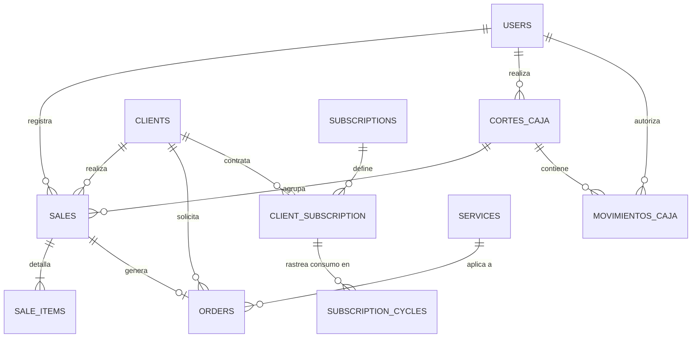

# Arquitectura de Base de Datos - BunnyKlin POS

Este documento proporciona una visión general del esquema de la base de datos relacional (MariaDB/MySQL) que respalda el sistema de Punto de Venta (POS) y gestión operativa de la lavandería BunnyKlin.

La base de datos está diseñada de manera modular, garantizando la integridad referencial y separando la lógica comercial en flujos de trabajo claros: ventas, control de efectivo, suscripciones de clientes y catálogo de productos/servicios.

## Diagrama de Entidad-Relación General (ERD)

A continuación, se muestra la relación principal entre las entidades centrales del sistema. (Se omiten campos menores para facilitar la lectura arquitectónica).

Módulos Principales

El esquema se divide lógicamente en cinco grandes módulos operativos. Cada módulo tiene su propia documentación detallada (enlaces a continuación):
1. Control de Caja y Usuarios

Gestiona la operatividad de los cajeros y el flujo de efectivo.

    users: Empleados del sistema y administradores.

    configuracion_caja: Parámetros globales y datos del negocio.

    cortes_caja: Turnos de caja, registrando el dinero esperado vs. el contado.

    movimientos_caja: Entradas y salidas de efectivo independientes a las ventas (gastos, retiros).

2. Catálogo de Inventario

Almacena los elementos comercializables del negocio.

    services: Servicios ofrecidos (ej. lavado por encargo, planchado).

    supplies: Insumos o productos físicos con control de stock (ej. detergentes, suavizantes).

3. Ventas y Pedidos (POS)

El núcleo transaccional del sistema.

    sales: Cabecera de la venta, almacena el total, método de pago y vinculación fiscal (facturapi_id).

    sale_items: Detalle de la venta. Utiliza instantáneas (name_snapshot, price_snapshot) para evitar que cambios futuros en el catálogo alteren el historial contable.

    orders: Gestión de pedidos de servicios a futuro, controlando fechas de entrega y anticipos. Se relaciona uno a uno con una venta.

4. Clientes y Facturación

    clients: Directorio de clientes con soporte para direcciones de envío y datos fiscales completos (RFC, régimen fiscal, código postal) requeridos por el SAT.

5. Suscripciones

Sistema automatizado para clientes recurrentes.

    subscriptions: Planes base de la lavandería (precio, duración, kilos permitidos).

    client_subscription: Vinculación de un cliente con un plan (estado activo/cancelado).

    subscription_cycles: Historial de consumo por mes/ciclo, rastreando los kilos_allowed vs kilos_consumed.

Decisiones de Diseño Clave

    Soft Deletes vs. Flags: En los catálogos (services, supplies, subscriptions) se utiliza un flag is_active en lugar de borrar registros, preservando la integridad de las ventas pasadas.

    Cumplimiento Fiscal: Las tablas transaccionales y de catálogo incluyen campos específicos (clave_prodserv, facturapi_id) listos para la integración de timbrado y facturación electrónica CFDI 4.0.

    Preservación Histórica: La tabla sale_items no depende exclusivamente del catálogo en tiempo real; guarda el precio y nombre del producto al momento exacto de la transacción mediante campos snapshot.

***
