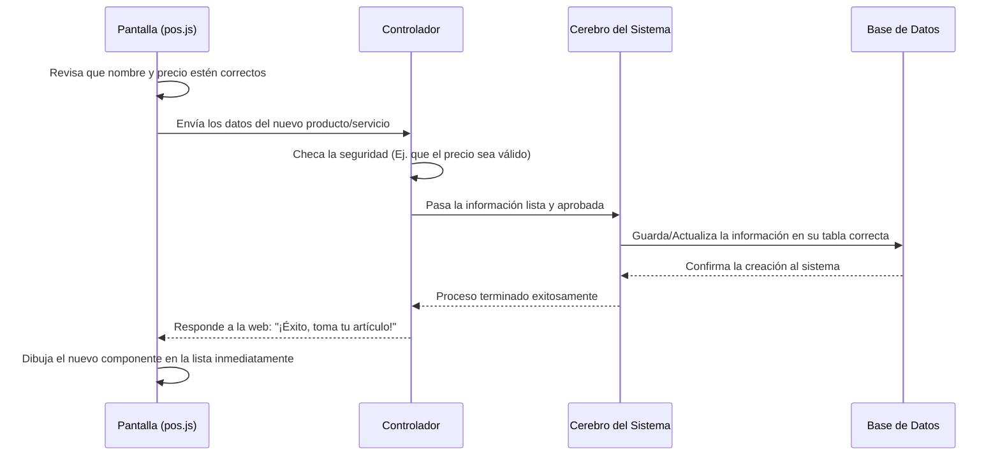

# Módulo: Catálogo de Servicios, Insumos y Suscripciones

## ¿Qué hace este módulo?
Este módulo es la sección donde los administradores pueden gestionar todo lo que se vende o se utiliza en la lavandería. Brinda la capacidad de dar de alta, editar, pausar o eliminar tres elementos principales:
1. **Servicios:** Lavado por kilo, planchado, tintorería, etc. (ya sean al instante o por encargo).
2. **Insumos:** Productos físicos como jabón o suavizante, manteniendo un control rápido de los almacenes o existencias (stock).
3. **Suscripciones:** Planes de fidelidad o mensualidades para clientes recurrentes.

Cualquier ajuste que se haga aquí (ej. cambiar un precio o pausar un servicio suspendido) se refleja de manera inmediata al momento de cobrar, asegurando que los usuarios de mostrador siempre vean los precios y productos reales.

---

## 1. Arquitectura de Flujo (Cómo viaja la información)

El siguiente diagrama de apoyo muestra, en pasos, el camino que recorre la información cuando el administrador decide, por ejemplo, **guardar un nuevo servicio**:



---

## 2. Lo que vemos en la Pantalla (Frontend)

**Archivos principales:** `servicios.blade.php`, `insumos.blade.php`, `suscripciones.blade.php` y su motor `pos.js`

### ¿De qué se encarga?
Brinda la cara visual y la experiencia principal. Toda esta pantalla está controlada por una herramienta web llamada **Alpine.js**. En vez de recargar la página web entera cada vez que apretamos un botón de guardar, la pantalla maneja una lista "en vivo". Cuando guardamos o eliminamos algo, la lista de servicios visual simplemente acomoda sus piezas de inmediato, sintiéndose como trabajar en una veloz aplicación de escritorio.

### Funciones que suceden tras bambalinas:
- **`adaptarCatalogo`:** Cuando el sitio carga por completo, esta pequeña función limpia el formato de los datos por precaución y los estandariza, así se evita que la pantalla se trabe por ver un "precio" que llegase distinto a lo normal.
- **Abrir y cerrar ventanas (Modales):** Existen par de instrucciones en el código (`openAddModal` y `openEditModal`) encargas de que el cuadro flotante (donde digitamos los nombres) se limpie si queremos crear algo, o que se precargue con los datos viejos si estamos editando.
- **Guardar la información:** Hay una función clave (`saveItem`) que recoge absolutamente todo lo que el usuario rellenó en la ventanita modal. Verifica a la velocidad de la luz que mínimamente tenga nombre. Luego empaca esa información y la manda al servidor silenciosamente.
- **Botón de Activar / Desactivar:** Para hacer más ameno el apagar temporalmente un servicio, al hacer clic sobre los pequeños botones estilo _switch_, la caja cambia de color de inmediato como ilusión óptica de agilidad, y por detrás le manda la orden al servidor (`toggleServiceStatus`).

---

## 3. El Guardián del Tráfico y sus Puertas (Controlador)

**Archivos:** `CatalogoController.php` y sus rutas `routes/web.php`

### Las Direcciones de las Puertas (Rutas)
Las "rutas" son las direcciones con donde la pantalla web se comunica con el servidor. Este módulo agrupó todas bajo la terminación `/catalogo` para ubicarlas fácilmente:

```php
Route::prefix('catalogo')->name('catalogo.')->group(function () {
    Route::patch('/toggle-estado', [CatalogoController::class, 'toggleEstado'])->name('toggle');
    Route::post('/guardar', [CatalogoController::class, 'store'])->name('store');
    Route::put('/actualizar', [CatalogoController::class, 'update'])->name('update');
    Route::delete('/eliminar', [CatalogoController::class, 'destroy'])->name('destroy');
});
```
Cada línea cumple reglas según el tipo de acción que le queramos dar:
- Empleamos algo llamado `POST` para mandar envíos completamente nuevos.
- Empleamos `PUT` para reemplazar cosas viejas por las nuevas.
- Empleamos `PATCH` si solamente es un cambio rápido y pequeño (como el botón verde de "Activo").
- Por su puesto usamos `DELETE` para desaparecer cosas.

### El rol del Controlador
El controlador **funciona estrictamente como un Policía o un Recepcionista**. 
Cada vez que la pantalla web manda un nuevo producto, el Controlador lo intercepta. Revisa obligatoriamente que lleve un nombre de tamaño prudente, y que el precio sí o sí sea un número válido sin símbolos raros que causen problemas.
Cuando ve que los datos aprueban la barrera de seguridad, los pasa al interior pero su labor acaba ahí; el controlador no guarda cosas, simplemente lo reenvía a quien realmente sabe empacar inventario.

---

## 4. El Cerebro de la Operación (Capa de Servicio)

**Archivo principal:** `CatalogoService.php`

### ¿De qué se encarga?
En programación, a esta parte se le llama "Lógica de negocio", pero coloquialmente es quien realmente procesa el trabajo pesado. Se dedica puntillosamente a decidir qué acciones realizar en nuestra Base de Datos cuando ya tenemos luz verde del Controlador. Esta pieza está tan enfocada, que si en futuras fechas se crea una app para teléfono móvil, esta app usaría el mismo cerebro sin tocar nada.

### ¿Qué hace el cerebro paso a paso?
Ya sea para agregar un nuevo elemento o actualizar uno viejo, procede en este orden:
1. **Identifica qué vamos a procesar:** Averigua velozmente si el Controlador le mandó un Servicio, un Producto físico o una Suscripción.
2. **Rellena los huecos faltantes:** Si el administrador en la pantalla dejó algo en blanco que no es super necesario (como que la cantidad de un jabón nuevo venga en cero), nuestro Cerebro se encarga de rellenarlo con valores estándar o predeterminados (`??`) para evitar agujeros a futuro en la tabla de datos.
3. **Manda a guardar en la base y devuelve el favor:** Abre el cajón exacto de base de datos para los elementos que tocan según su nombre, los inserta exitosamente, y le avisa de retache al Controlador: _"Ya lo subí, tómalo de vuelta"_.
4. **Manejo de pánico (Excepciones):** Si se da el raro caso de que alguien intentó obligar de fondo algo que no es los anteriores tres (Ejemplo: le piden que inserte cosas en una tabla de `clientes` a través del servicio de catálogos), nuestro Cerebro se bloquea instantáneamente, levanta un muro de prevención (`throw new \Exception`), detiene todo desastre, devolviendo amablemente un aviso final con el error para notificarle a la web y proteger así la aplicación.
