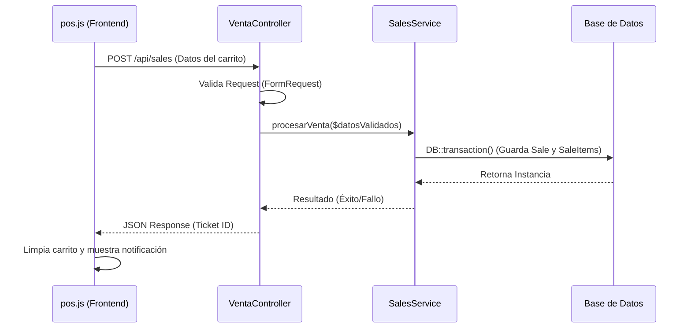

# Módulo: [Nombre del Módulo, ej. Punto de Venta (POS)]

Breve descripción de lo que hace este módulo desde la perspectiva del usuario
final. (Ej. Interfaz principal para el cobro de servicios, gestión del carrito y
procesamiento de pagos).

## 1. Arquitectura de Flujo (Diagrama de Secuencia)

Usa un diagrama para mostrar cómo viaja la información desde que el usuario hace
clic hasta que se guarda en la base de datos.

## 2. Frontend (Vista y JavaScript)

**Archivos involucrados:** `pos.blade.php`, `pos.js`

### Responsabilidad

- (Ej. Manejar el estado del carrito en memoria, calcular subtotales en tiempo
  real y capturar el evento de pago).

### Funciones principales en JavaScript

#### `agregarAlCarrito(item)`

Explicar qué lógica sigue antes de enviarlo al backend.

#### `procesarPago()`

Explicar cómo recolecta los datos del DOM y arma el _payload_ para enviarlo
mediante `fetch` o `axios`.

### Manejo de estado e interfaz (UI)

Explicar cómo reacciona la interfaz mientras espera la respuesta del controlador
(por ejemplo, deshabilitar botones, mostrar _loaders_, etc.).

---

## 3. Controlador (Enrutamiento y Validación)

**Archivo:** `VentaController.php`

### Responsabilidad

Actuar exclusivamente como un "semáforo". Recibe la petición HTTP, valida que
los datos vengan en el formato correcto y delega el trabajo pesado.

### Endpoints clave

#### `POST /ventas`

Recibe el _payload_ enviado desde `pos.js`.

### Lógica implementada

- Explicar si se utilizan **Form Requests** para la validación.
- Mostrar cómo se inyecta `SalesService` en el constructor o en el método
  correspondiente.

---

## 4. Capa de Servicio (Lógica de Negocio)

**Archivo:** `SalesService.php`

### Responsabilidad

Contiene las reglas de negocio, los cálculos complejos y las escrituras a la
base de datos. Está desacoplado de las peticiones HTTP para poder reutilizarse
(por ejemplo, si en el futuro se desarrolla una API móvil, puede utilizar el
mismo servicio).

### Métodos clave

#### `crearVenta(array $datos)`

Explicar paso a paso qué realiza el método, por ejemplo:

1. Abre una transacción de base de datos.
2. Genera el folio único.
3. Guarda la cabecera de la venta.
4. Itera sobre los elementos del carrito para generar las instantáneas
   (_snapshots_) de precios.
5. Confirma la transacción.

#### Manejo de excepciones

Explicar cómo se capturan los errores de base de datos y cómo se devuelven de
forma limpia al controlador.
